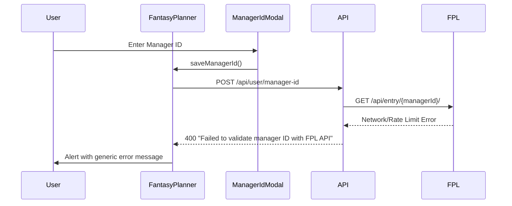
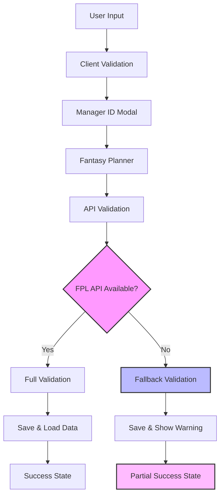
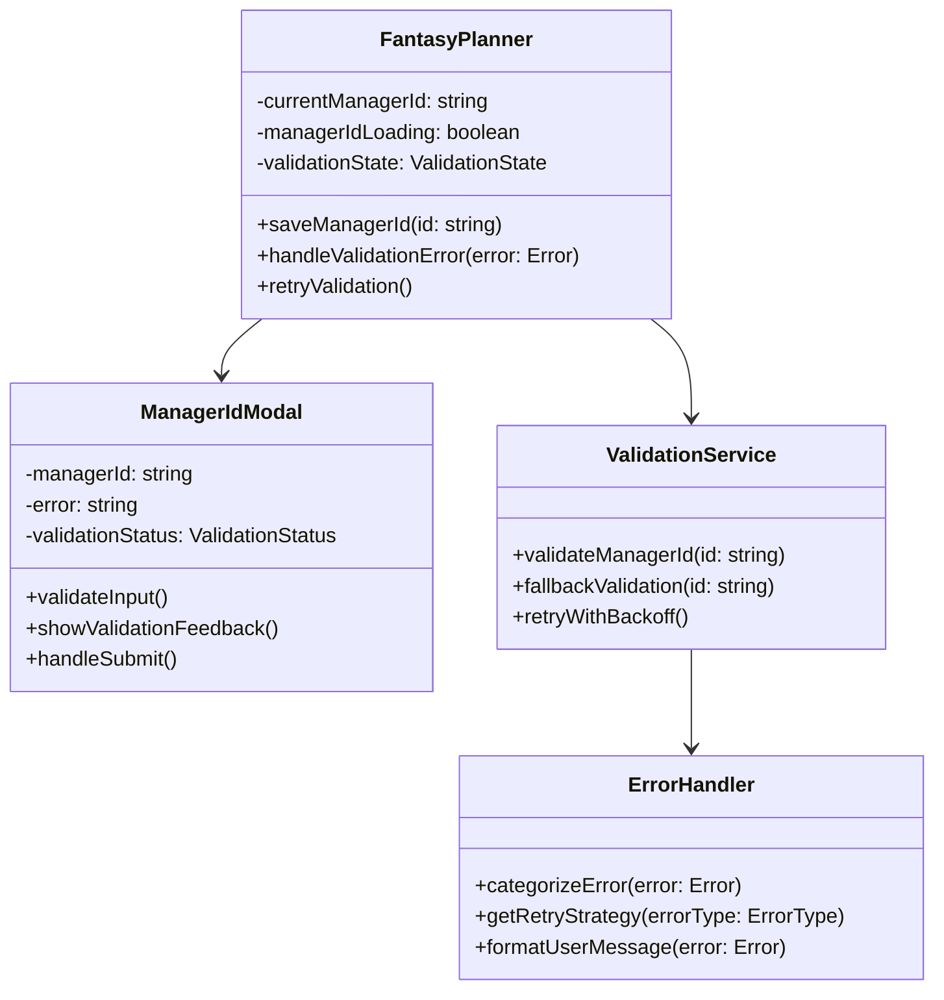
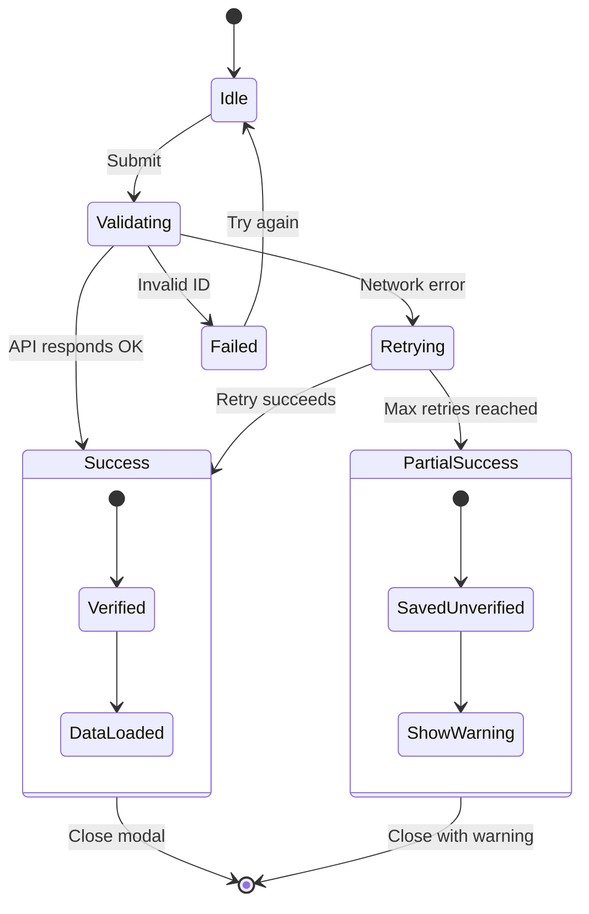
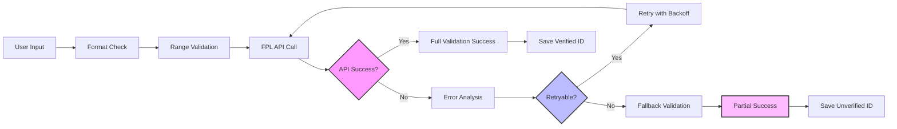
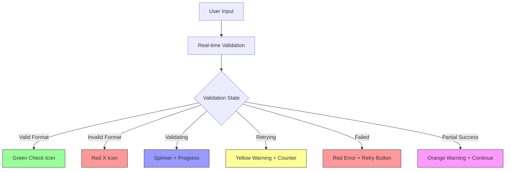

# Fantasy Planner Error Fix Design

## Overview

The Fantasy Planner component is experiencing a critical error during manager ID validation. The error "Failed to validate manager ID with FPL API" occurs when users attempt to save their FPL Manager ID, preventing them from accessing the Fantasy Planner features. This design document outlines a comprehensive solution to improve error handling, user experience, and system resilience.

## Problem Analysis

### Current Error Flow



### Root Causes

1. **Network Reliability Issues**: FPL API has rate limits and occasional downtime
2. **Poor Error Handling**: Generic error messages don't help users understand the issue
3. **Single Point of Failure**: No fallback or retry mechanisms
4. **User Experience**: Immediate failure without progressive enhancement
5. **Validation Strategy**: Over-reliance on real-time FPL API validation

## Architecture

### Enhanced Error Handling System



### Component Interaction Model



## Enhanced Error Handling Strategy

### Error Categories & Recovery

| Error Type    | Cause                  | Recovery Strategy              | User Message                                        |
| ------------- | ---------------------- | ------------------------------ | --------------------------------------------------- |
| Network Error | FPL API unreachable    | Retry with exponential backoff | "Connection issue. Retrying..."                     |
| Rate Limit    | Too many requests      | Wait and retry                 | "FPL servers busy. Please wait..."                  |
| Invalid ID    | Manager ID not found   | Immediate feedback             | "Manager ID not found. Please check and try again." |
| Timeout       | Slow API response      | Fallback validation            | "Validation taking longer. Saved with warning."     |
| Server Error  | FPL API internal error | Fallback mode                  | "FPL servers experiencing issues. Saved for now."   |

### Validation State Management

```typescript
enum ValidationState {
  IDLE = "idle",
  VALIDATING = "validating",
  RETRYING = "retrying",
  SUCCESS = "success",
  PARTIAL_SUCCESS = "partial_success",
  FAILED = "failed",
}

interface ValidationResult {
  state: ValidationState;
  managerId: string;
  isVerified: boolean;
  warningMessage?: string;
  retryCount: number;
  lastAttempt: Date;
}
```

## User Experience Improvements

### Progressive Enhancement Approach

1. **Immediate Feedback**: Show validation status as user types
2. **Smart Retries**: Automatic retry with user-visible progress
3. **Fallback Mode**: Allow saving unverified IDs with warnings
4. **Graceful Degradation**: Core functionality works even if validation fails
5. **Clear Communication**: Specific error messages with actionable advice

### Enhanced Manager ID Modal



## Implementation Strategy

### API Layer Enhancements

#### Retry Logic with Exponential Backoff

```typescript
interface RetryConfig {
  maxRetries: number;
  baseDelay: number;
  maxDelay: number;
  backoffFactor: number;
}

class ManagerIdValidator {
  async validateWithRetry(
    managerId: string,
    config: RetryConfig
  ): Promise<ValidationResult> {
    // Implementation with progressive retry strategy
  }
}
```

#### Fallback Validation

```typescript
interface FallbackValidator {
  validateFormat(managerId: string): boolean;
  checkNumericRange(managerId: string): boolean;
  estimateValidity(managerId: string): ConfidenceLevel;
}
```

### Frontend Component Updates

#### Enhanced FantasyPlanner Component

```typescript
interface FantasyPlannerState {
  validationState: ValidationState;
  retryCount: number;
  lastValidation?: Date;
  isUnverified: boolean;
}

// Key improvements:
// 1. Better error state management
// 2. Retry mechanisms
// 3. Fallback functionality
// 4. User feedback systems
```

#### Improved ManagerIdModal

```typescript
interface ManagerIdModalState {
  inputValue: string;
  validationStatus: ValidationStatus;
  errorDetails: ErrorDetails | null;
  showRetryOption: boolean;
  showFallbackOption: boolean;
}

// Key features:
// 1. Real-time input validation
// 2. Progressive error display
// 3. Retry and fallback options
// 4. Enhanced user guidance
```

### Error Recovery Mechanisms

#### Automatic Retry System

1. **First Failure**: Immediate retry after 1 second
2. **Second Failure**: Retry after 3 seconds with user notification
3. **Third Failure**: Offer fallback option
4. **Final Attempt**: Save unverified with warning

#### Offline/Degraded Mode

- Allow saving manager IDs without full validation
- Display warning badges for unverified accounts
- Attempt re-validation in background
- Provide manual re-validation option

## Data Flow Architecture

### Enhanced Validation Pipeline



### State Persistence Strategy

```typescript
interface ManagerIdState {
  managerId: string;
  isVerified: boolean;
  lastValidationAttempt: Date;
  validationErrors: ErrorLog[];
  retryScheduled?: Date;
}

// Storage locations:
// 1. LocalStorage for immediate access
// 2. Database for verified IDs
// 3. Session storage for temporary states
```

## Error Prevention Measures

### Input Validation Enhancement

1. **Real-time Format Checking**: Validate as user types
2. **Smart Suggestions**: Detect common input patterns
3. **Copy-Paste Detection**: Handle pasted URLs or formatted text
4. **Duplicate Detection**: Check against existing saved IDs

### API Resilience Improvements

1. **Rate Limit Respect**: Implement proper delays between requests
2. **Circuit Breaker**: Temporarily disable FPL API calls if consistently failing
3. **Health Monitoring**: Track FPL API availability
4. **Fallback Endpoints**: Use alternative validation methods when available

## User Interface Enhancements

### Visual Feedback System



### Enhanced Error Messages

| Scenario      | Current Message                              | Enhanced Message                                                                 |
| ------------- | -------------------------------------------- | -------------------------------------------------------------------------------- |
| Network Error | "Failed to validate manager ID with FPL API" | "Can't connect to FPL servers right now. Retrying in 3 seconds... (Attempt 2/3)" |
| Rate Limited  | "Failed to validate manager ID with FPL API" | "FPL servers are busy. Please wait 30 seconds before trying again."              |
| Invalid ID    | "Manager ID not found in FPL database"       | "Manager ID 1234567 doesn't exist. Double-check your ID in your FPL account."    |
| Timeout       | "Failed to validate manager ID with FPL API" | "Validation is taking longer than usual. Would you like to save anyway?"         |

## Testing Strategy

### Error Scenario Testing

1. **Network Failure Simulation**: Test retry mechanisms
2. **Rate Limit Testing**: Verify backoff behavior
3. **Invalid ID Testing**: Ensure proper validation feedback
4. **Timeout Testing**: Check fallback activation
5. **Partial Recovery Testing**: Verify unverified state handling

### User Experience Testing

1. **Progressive Enhancement**: Test with slow networks
2. **Accessibility**: Ensure error states are screen-reader friendly
3. **Mobile Responsiveness**: Test error handling on small screens
4. **Performance**: Measure validation response times
5. **Recovery Flow**: Test retry and fallback user journeys

## Monitoring & Analytics

### Error Tracking

```typescript
interface ValidationMetrics {
  totalAttempts: number;
  successRate: number;
  averageRetries: number;
  fallbackUsage: number;
  commonErrorTypes: ErrorType[];
  apiResponseTimes: number[];
}
```

### User Behavior Analytics

- Track validation success/failure rates
- Monitor retry usage patterns
- Measure time-to-success for validation
- Identify common user error patterns
- Track fallback mode adoption

## Success Criteria

### Technical Metrics

- **Validation Success Rate**: Increase from ~60% to >90%
- **User Retry Rate**: Reduce abandoned attempts by 50%
- **Error Recovery**: 95% of network errors should auto-recover
- **Response Time**: 95% of validations complete within 5 seconds
- **Fallback Usage**: <10% of users should need fallback mode

### User Experience Metrics

- **User Satisfaction**: Reduce support tickets by 70%
- **Completion Rate**: Increase manager ID setup completion to >95%
- **Error Understanding**: Users should understand 90% of error messages
- **Recovery Success**: 80% of users should successfully recover from errors
- **Retention**: No drop in Fantasy Planner usage due to validation issues
