# Fantasy Planner Redesign - Enhanced Transfer Planning System

## Overview

This design document outlines the comprehensive redesign of the Fantasy Planner component to create a modern, mobile-friendly, and feature-rich fantasy football transfer planning system. The redesign focuses on improving the pitch visualization, creating an advanced list view with filtering capabilities, integrating fixture data for strategic planning, and implementing a professional transfer planner interface.

## Technology Stack & Dependencies

- **Frontend Framework**: Next.js 15 with React 19
- **Styling**: Tailwind CSS with mobile-first approach
- **Animations**: Framer Motion for smooth transitions
- **State Management**: React hooks with Context API
- **API Integration**: FPL Bootstrap-Static endpoint, fixtures data
- **UI Components**: Custom components with responsive design
- **Icons**: Lucide React icons

## Component Architecture

### Core Component Structure

```
FantasyPlanner/
├── PitchView/
│   ├── MobileFriendlyPitch
│   ├── PlayerPositioning
│   └── FormationDisplay
├── ListView/
│   ├── PlayerListTable
│   ├── FilterSidebar
│   └── PlayerComparison
├── TransferPlanner/
│   ├── TransferInterface
│   ├── FixtureAnalysis
│   └── BudgetCalculator
└── SharedComponents/
    ├── PlayerCard
    ├── TeamSelector
    └── StatisticsPanel
```

### Component Hierarchy

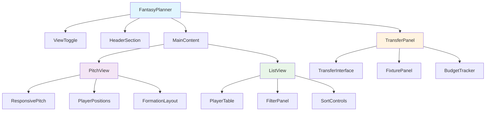

## Responsive Pitch Design

### Mobile-First Pitch Layout

The pitch will be redesigned to be fully responsive with optimal display across all device sizes:

#### Desktop Layout (1024px+)

- Full field pitch representation
- Horizontal layout with complete field visualization
- Side panels for transfer tools and statistics
- Interactive player positioning with drag-and-drop capability

#### Tablet Layout (768px - 1023px)

- Vertical pitch orientation
- Collapsed side panels with overlay modals
- Touch-optimized player interactions
- Swipeable sections for better navigation

#### Mobile Layout (< 768px)

- Compact vertical pitch
- Full-width display utilizing entire screen
- Bottom sheet for transfer controls
- Simplified player representations with essential data

### Player Positioning Strategy

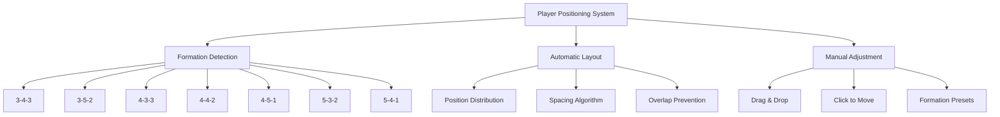

## Enhanced List View

### Player Table Features

The list view will provide comprehensive player analysis with advanced filtering and sorting capabilities:

#### Table Columns

- **Basic Info**: Name, Team, Position, Price
- **Performance**: Points, Form, Minutes Played
- **Statistics**: Goals, Assists, Clean Sheets, Saves
- **Ownership**: Selected By %, Transfer Activity
- **Fixtures**: Next 3 matches with difficulty rating
- **Value**: Points per million, Price change trend

#### Advanced Filtering System

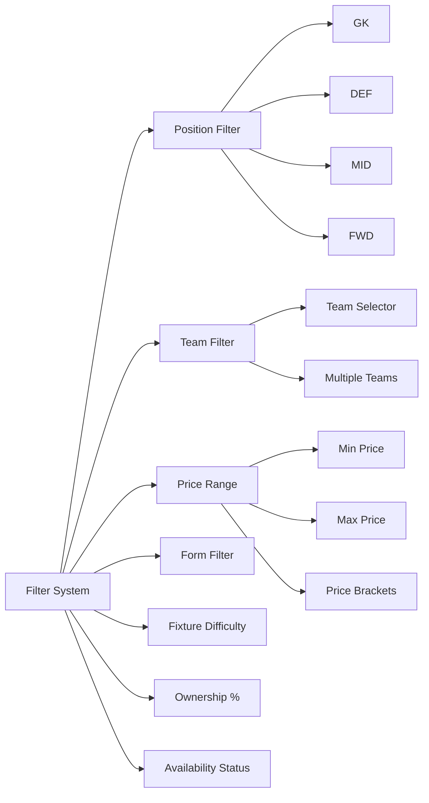

### Filter Categories

1. **Position Filters**

   - Goalkeeper (GK)
   - Defender (DEF)
   - Midfielder (MID)
   - Forward (FWD)

2. **Team Filters**

   - Individual team selection
   - Multiple team filtering
   - Big 6 quick filter
   - Promoted teams filter

3. **Performance Filters**

   - Form rating (1-5 stars)
   - Points threshold
   - Minutes played percentage
   - Injury status

4. **Financial Filters**

   - Price range sliders
   - Value for money ratio
   - Price change trends
   - Budget availability

5. **Fixture Filters**
   - Fixture difficulty rating
   - Home/Away preference
   - Number of fixtures
   - Double gameweek availability

## Transfer Planner Integration

### Transfer Interface Design

The transfer planner will be integrated as a sophisticated planning tool with the following components:

#### Transfer Actions Panel

- **Player In/Out Selection**: Drag-and-drop or click-to-select
- **Transfer Cost Calculator**: Real-time cost calculation
- **Budget Tracker**: Remaining budget display
- **Free Transfer Counter**: Available free transfers

#### Fixture Analysis Integration

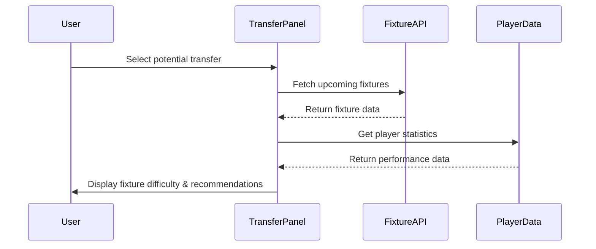

### Fixture Analysis Features

1. **Upcoming Fixtures Display**

   - Next 5 gameweeks fixture list
   - Fixture difficulty rating (1-5)
   - Home/Away indicator
   - Double gameweek highlighting

2. **Difficulty Calculation**

   - Team strength analysis
   - Home advantage factor
   - Recent form consideration
   - Historical performance data

3. **Strategic Recommendations**
   - Best time to transfer players
   - Captain recommendations
   - Chip usage suggestions
   - Long-term planning advice

## Data Integration Strategy

### Bootstrap-Static API Integration

The component will leverage the existing bootstrap-static endpoint to fetch comprehensive player and team data:

#### Data Fetching Flow

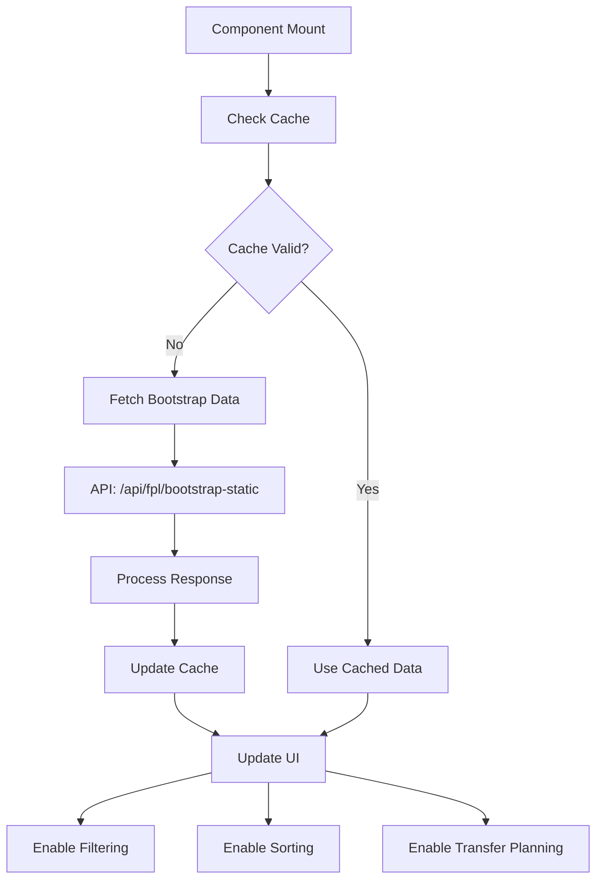

#### Data Structure Utilization

1. **Elements (Players)**

   - Personal information and team affiliation
   - Performance statistics and form
   - Pricing and ownership data
   - Fixture difficulty ratings

2. **Teams**

   - Team information and colors
   - Strength ratings
   - Fixture schedules

3. **Element Types**

   - Position definitions
   - Squad size limitations
   - Formation rules

4. **Events (Gameweeks)**
   - Current gameweek information
   - Deadline dates
   - Chip availability

## Mobile Optimization Strategy

### Responsive Design Principles

1. **Touch-First Interface**

   - Minimum 44px touch targets
   - Gesture-based navigation
   - Swipe interactions for panels

2. **Performance Optimization**

   - Lazy loading for player images
   - Virtual scrolling for large lists
   - Optimized animations with reduced motion

3. **Layout Adaptations**
   - Collapsible sidebar panels
   - Bottom sheet for transfer actions
   - Horizontal scrolling for wide tables

### Mobile-Specific Features

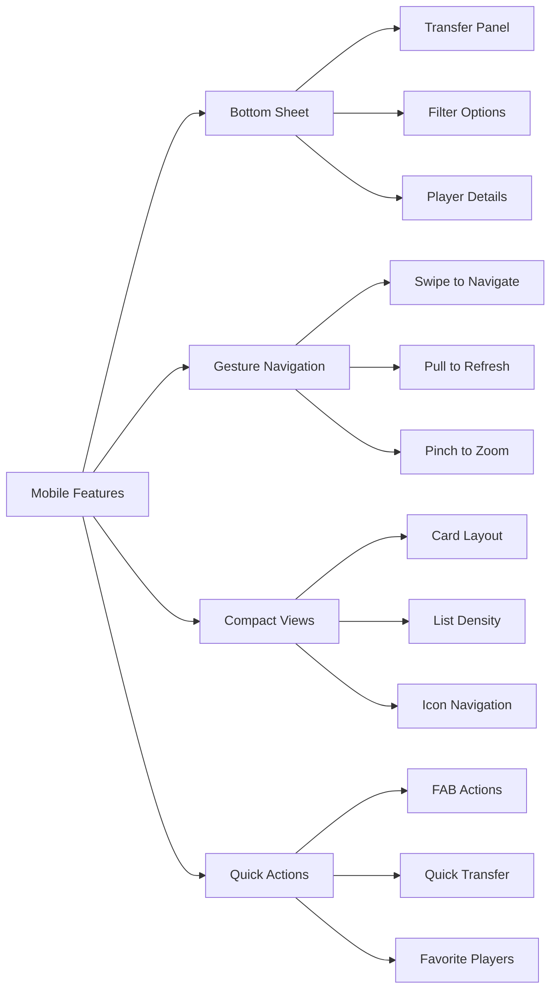

## User Interface Components

### PlayerCard Component

A reusable player card component with multiple display modes:

#### Card Variants

1. **Pitch Mode**: Compact representation for pitch display
2. **List Mode**: Detailed information for table rows
3. **Comparison Mode**: Side-by-side statistics
4. **Transfer Mode**: Action-focused with transfer buttons

#### Card Information Hierarchy

- **Primary**: Name, Position, Price
- **Secondary**: Team, Form, Points
- **Tertiary**: Statistics, Fixtures, Trends

### TransferInterface Component

Sophisticated transfer planning interface with:

#### Transfer Workflow

1. **Player Selection**: Browse and filter available players
2. **Comparison**: Compare multiple players side-by-side
3. **Planning**: Add to transfer shortlist
4. **Execution**: Confirm transfers with cost calculation
5. **Analysis**: Review impact on team and budget

### FixturePanel Component

Comprehensive fixture analysis tool featuring:

#### Fixture Visualization

- **Timeline View**: Chronological fixture display
- **Difficulty Matrix**: Visual difficulty ratings
- **Team Comparison**: Compare fixtures between teams
- **Strategic Insights**: AI-powered recommendations

## State Management Architecture

### State Structure

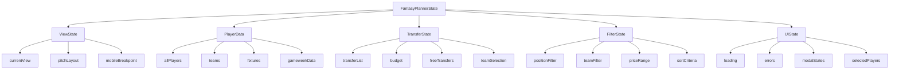

### Data Flow Pattern

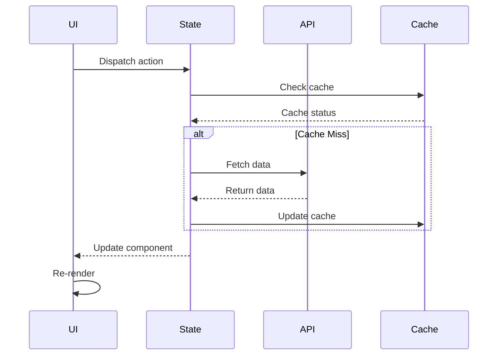

## Performance Optimization

### Rendering Optimizations

1. **Virtual Scrolling**

   - Large player lists with thousands of items
   - Smooth scrolling performance
   - Memory usage optimization

2. **Memoization Strategy**

   - React.memo for player components
   - useMemo for expensive calculations
   - useCallback for event handlers

3. **Code Splitting**
   - Lazy loading of view components
   - Dynamic imports for heavy features
   - Progressive loading of data

### Caching Strategy

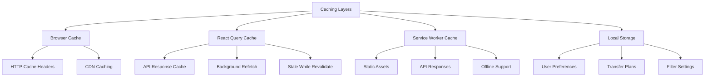

## Error Handling & Resilience

### Error Scenarios

1. **API Failures**

   - Bootstrap data unavailable
   - Timeout errors
   - Rate limiting

2. **Data Inconsistencies**

   - Missing player data
   - Outdated information
   - Invalid formations

3. **User Interface Errors**
   - Invalid transfer selections
   - Budget constraints
   - Formation violations

### Recovery Mechanisms

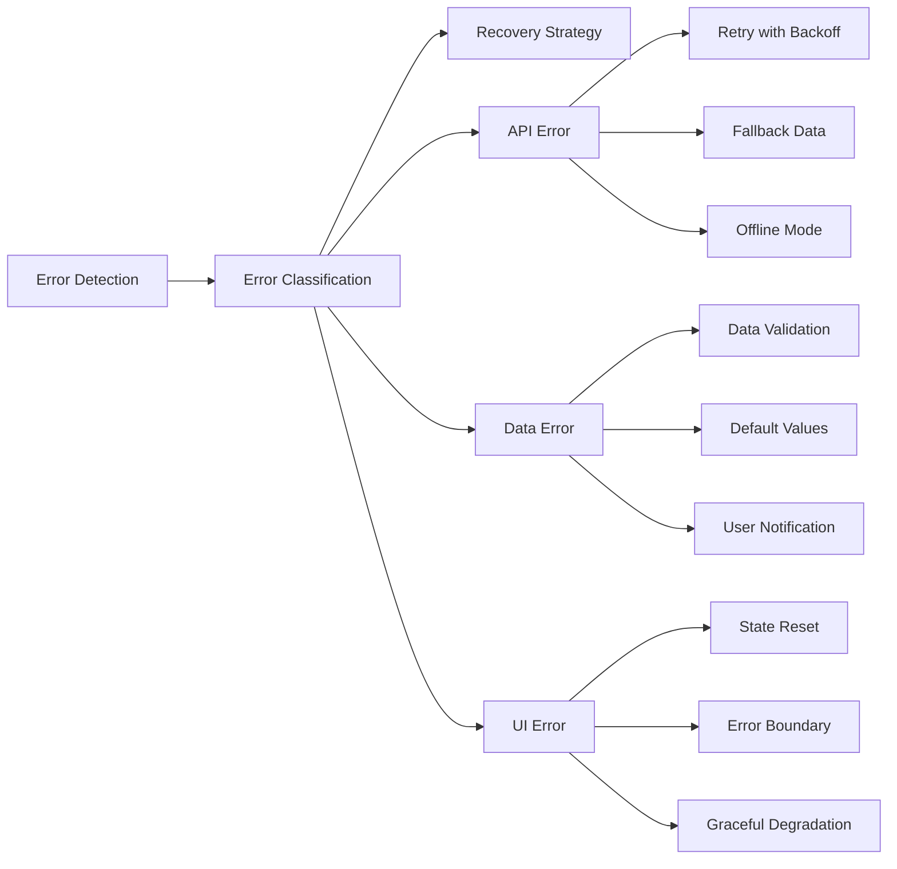

## Testing Strategy

### Component Testing

1. **Unit Tests**

   - Individual component functionality
   - State management logic
   - Utility functions

2. **Integration Tests**

   - Component interaction
   - API integration
   - Data flow testing

3. **Visual Regression Tests**
   - UI consistency across devices
   - Layout integrity
   - Animation testing

### Performance Testing

1. **Load Testing**

   - Large dataset rendering
   - Concurrent user scenarios
   - Memory usage monitoring

2. **Mobile Performance**
   - Touch responsiveness
   - Scroll performance
   - Battery usage optimization

## Accessibility & Usability

### Accessibility Features

1. **Keyboard Navigation**

   - Tab order management
   - Focus indicators
   - Keyboard shortcuts

2. **Screen Reader Support**

   - ARIA labels and descriptions
   - Semantic HTML structure
   - Live region updates

3. **Visual Accessibility**
   - High contrast mode support
   - Font size scaling
   - Color blind friendly design

### Usability Enhancements

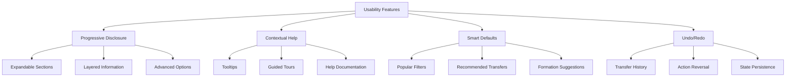
