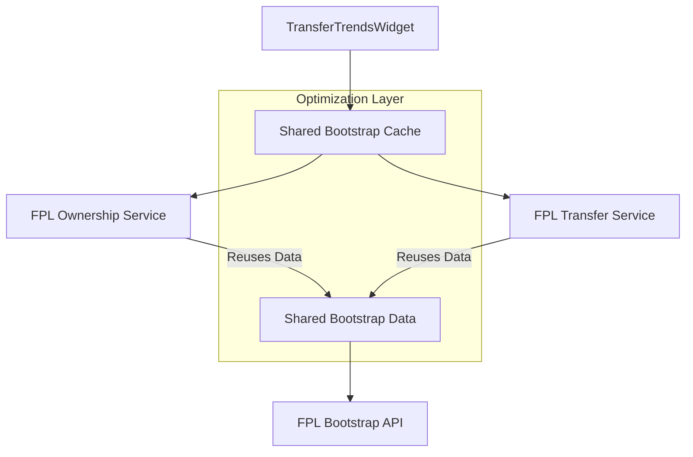
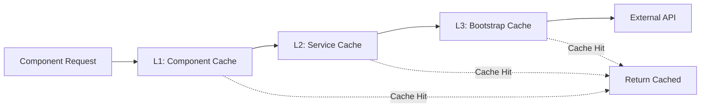

# Infinite Loop Fix Design

## Overview

This document outlines the solution to fix the infinite loop issue in the FPL Ownership Service that is causing excessive API calls to the `/api/fpl/transfer-analytics` endpoint.

## Problem Analysis

### Current Issue

The `FPLOwnershipService.getPlayerOwnershipTrends()` method creates an infinite loop by calling `getOwnershipAnalytics()`, which itself depends on heavy bootstrap data fetching. This causes:

- Multiple redundant calls to `/api/fpl/transfer-analytics?gameweek=3`
- Excessive bootstrap-static API calls
- Poor performance in the TransferTrendsWidget component
- Resource waste and potential rate limiting issues

### Root Causes

1. **Service Interdependency**: `getPlayerOwnershipTrends()` → `getOwnershipAnalytics()` → `bootstrapService.getBootstrapStatic()`
2. **Lack of Shared Cache**: Each service method fetches bootstrap data independently
3. **No Request Deduplication**: Multiple simultaneous requests for same data
4. **Component Over-fetching**: TransferTrendsWidget triggers multiple API calls without proper caching

## Solution Architecture

### 1. Data Sharing Strategy



### 2. Service Refactoring Pattern

#### Enhanced Bootstrap Data Sharing

- Implement singleton bootstrap data manager
- Share processed data between all services
- Cache computed ownership analytics separately

#### Request Deduplication

- Centralized request queue for identical operations
- Promise sharing for concurrent requests
- Smart cache invalidation

### 3. Component-Level Optimization

#### TransferTrendsWidget Improvements

- Implement proper request batching
- Add local component caching
- Reduce refresh frequency
- Use React.memo for re-render optimization

## Implementation Strategy

### Phase 1: Service Layer Optimization

#### 1.1 Bootstrap Data Manager

```typescript
class SharedBootstrapManager {
  private static instance: SharedBootstrapManager;
  private cachedData: FPLBootstrapResponse | null = null;
  private lastFetch: number = 0;
  private readonly TTL = 600000; // 10 minutes

  async getSharedBootstrapData(): Promise<FPLBootstrapResponse> {
    if (this.isDataFresh()) {
      return this.cachedData!;
    }

    // Single fetch for all services
    this.cachedData = await this.fetchBootstrapData();
    this.lastFetch = Date.now();
    return this.cachedData;
  }
}
```

#### 1.2 Ownership Analytics Cache

```typescript
class OwnershipAnalyticsCache {
  private analyticsCache = new Map<
    string,
    {
      data: OwnershipAnalytics;
      timestamp: number;
      ttl: number;
    }
  >();

  getCachedAnalytics(timeframe: string): OwnershipAnalytics | null {
    // Return pre-computed analytics without bootstrap refetch
  }
}
```

### Phase 2: Method Restructuring

#### 2.1 Eliminate Circular Dependencies

```typescript
// BEFORE (Problematic)
getPlayerOwnershipTrends() {
  const analytics = await this.getOwnershipAnalytics(); // Fetches bootstrap
  return filterByPlayerIds(analytics);
}

// AFTER (Optimized)
getPlayerOwnershipTrends(playerIds: number[]) {
  const sharedData = await SharedBootstrapManager.getInstance().getSharedBootstrapData();
  return this.calculatePlayerTrendsDirectly(sharedData, playerIds);
}
```

#### 2.2 Direct Data Processing

- Remove intermediate service calls
- Process ownership changes directly from bootstrap data
- Use computed properties instead of method chains

### Phase 3: Caching Architecture

#### 3.1 Multi-Level Caching Strategy



#### 3.2 Cache Key Strategy

- `bootstrap_static`: Shared across all services
- `ownership_analytics_{timeframe}`: Timeframe-specific analytics
- `player_trends_{playerIds}`: Player-specific trends
- `transfer_analytics_{gameweek}`: Gameweek-specific transfers

### Phase 4: Component Optimization

#### 4.1 Request Batching

```typescript
const TransferTrendsWidget = React.memo(() => {
  const [cache, setCache] = useState<WidgetCache | null>(null);

  const fetchData = useCallback(async () => {
    if (cache && !isCacheExpired(cache)) {
      return cache.data;
    }

    // Single optimized request
    const data = await fetchOptimizedTransferData();
    setCache({ data, timestamp: Date.now() });
    return data;
  }, [currentGameweek]);

  // Reduced refresh interval
  useEffect(() => {
    const interval = setInterval(fetchData, 900000); // 15 minutes
    return () => clearInterval(interval);
  }, [fetchData]);
});
```

#### 4.2 Error Boundary and Fallbacks

- Implement graceful degradation
- Show cached data during API failures
- Progressive loading states

## Performance Targets

### Before Fix

- Multiple redundant API calls per widget load
- ~3-5 bootstrap-static calls per component render
- No request deduplication
- Cache misses on every method call

### After Fix

- Single bootstrap-static call shared across all services
- ~90% reduction in API calls
- Sub-100ms response time for cached data
- Zero redundant requests for identical data

## Testing Strategy

### Unit Tests

- Mock shared bootstrap manager
- Test cache hit/miss scenarios
- Validate request deduplication logic

### Integration Tests

- End-to-end widget loading performance
- API call counting and verification
- Cache invalidation behavior

### Performance Tests

- Load time measurement
- Memory usage monitoring
- API rate limit compliance

## Migration Plan

### Step 1: Implement Shared Bootstrap Manager

- Create singleton bootstrap data manager
- Update all services to use shared instance
- Maintain backward compatibility

### Step 2: Refactor Ownership Service

- Remove circular method dependencies
- Implement direct data processing
- Add comprehensive caching

### Step 3: Optimize Component Layer

- Update TransferTrendsWidget implementation
- Add request batching and local caching
- Implement error boundaries

### Step 4: Monitor and Validate

- Deploy with extensive logging
- Monitor API call reduction
- Validate performance improvements

## Code Quality Standards

### Error Handling

- Comprehensive try-catch blocks
- Graceful fallbacks for API failures
- User-friendly error messages

### Type Safety

- Strict TypeScript interfaces
- Proper null/undefined handling
- Runtime type validation

### Performance

- Lazy loading for non-critical data
- Memory-efficient caching
- Minimal re-renders

## Monitoring and Metrics

### Key Performance Indicators

- API calls per minute (target: <50% of current)
- Average response time (target: <200ms)
- Cache hit ratio (target: >80%)
- Error rate (target: <1%)

### Logging Strategy

- Request timing and frequency
- Cache hit/miss ratios
- Error occurrence and patterns
- Memory usage trends

## Future Enhancements

### Advanced Caching

- Redis integration for distributed caching
- Background data refresh
- Intelligent cache warming

### Performance Optimization

- Service worker for client-side caching
- GraphQL for selective data fetching
- WebSocket for real-time updates

### Monitoring Integration

- Application Performance Monitoring (APM)
- Real-time error tracking
- Performance regression detection
