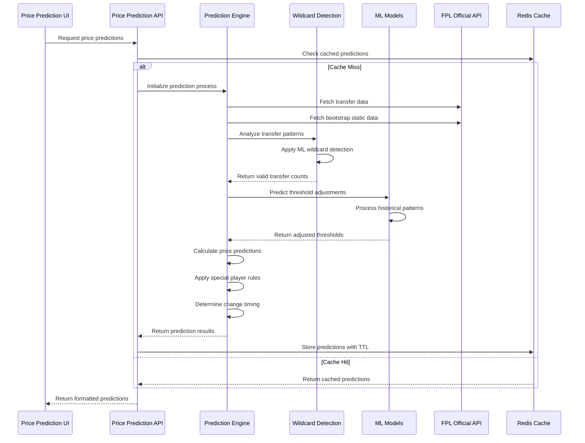
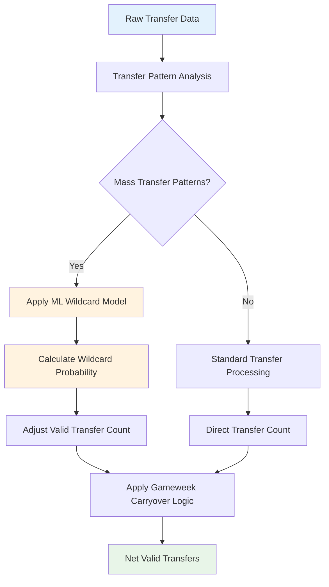
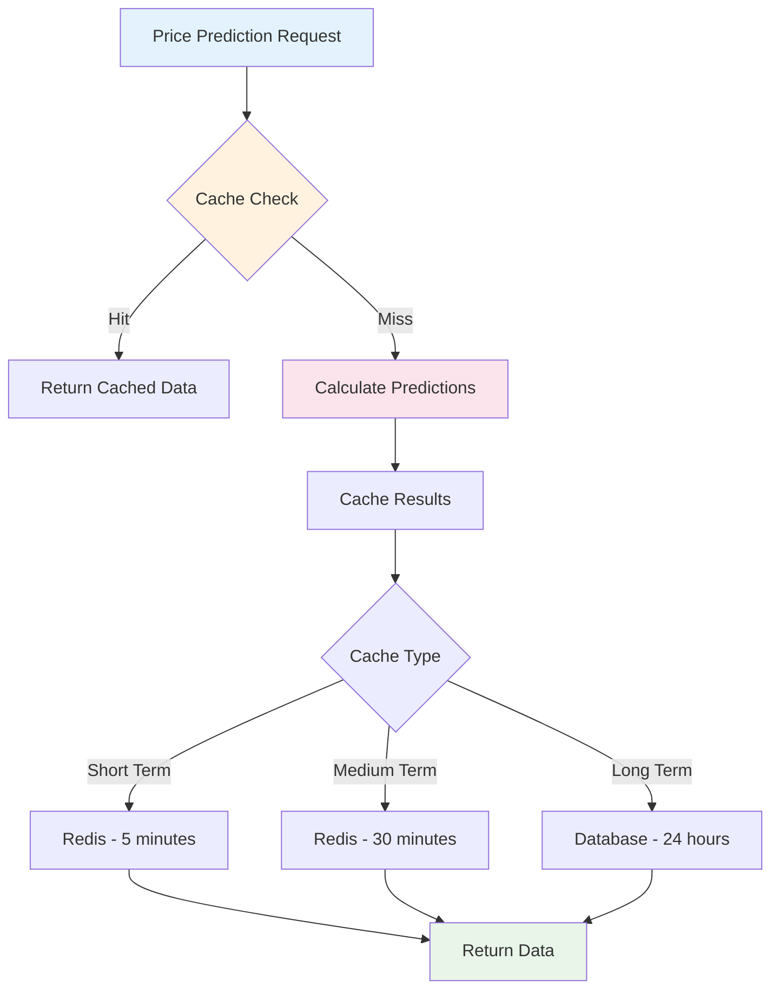

# FPL Price Prediction Algorithm Design

## Overview

This design document outlines the implementation of a sophisticated FPL (Fantasy Premier League) price prediction algorithm inspired by LiveFPL's industry-leading prediction system. The algorithm aims to predict player price changes with high accuracy by analyzing transfer volumes, ownership percentages, player form, and implementing advanced wildcard detection and machine learning techniques.

## Architecture

### Core Components

```mermaid
graph TB
    A[Price Prediction Engine] --> B[Data Collection Layer]
    A --> C[Wildcard Detection Service]
    A --> D[Transfer Analysis Engine]
    A --> E[Machine Learning Models]
    A --> F[Threshold Calculation System]

    B --> B1[FPL API Client]
    B --> B2[Bootstrap Data Service]
    B --> B3[Transfer Data Aggregator]

    C --> C1[Wildcard Pattern Analyzer]
    C --> C2[Transfer Validation Engine]
    C --> C3[Historical Sample Processor]

    D --> D1[Net Transfer Calculator]
    D --> D2[Ownership Impact Analyzer]
    D --> D3[Form Integration Service]

    E --> E1[Transfer Volume Predictor]
    E --> E2[Gameweek Carryover Model]
    E --> E3[Flag Change Impact Model]

    F --> F1[Dynamic Threshold Calculator]
    F --> F2[Ownership-Based Adjuster]
    F --> F3[Special Player Handler]

    style A fill:#2196F3,stroke:#333,color:white
    style B fill:#4CAF50,stroke:#333,color:white
    style C fill:#FF9800,stroke:#333,color:white
    style D fill:#9C27B0,stroke:#333,color:white
    style E fill:#F44336,stroke:#333,color:white
    style F fill:#607D8B,stroke:#333,color:white
```



### Data Flow Architecture



## Core Algorithm Components

### 1. Enhanced Transfer Data Processing

```typescript
interface TransferData {
  player_id: number;
  transfers_in_event: number;
  transfers_out_event: number;
  transfers_in_24h: number;
  transfers_out_24h: number;
  wildcard_probability: number;
  valid_transfers_in: number;
  valid_transfers_out: number;
  net_valid_transfers: number;
}

interface PlayerMetrics {
  ownership_percentage: number;
  form_score: number;
  recent_points: number;
  flag_status: "none" | "yellow" | "red";
  flag_change_timestamp?: string;
  price_tier: "budget" | "mid" | "premium";
  special_player_status: boolean;
}
```

### 2. Wildcard Detection Algorithm

The wildcard detection system uses machine learning to identify patterns in transfer behavior that indicate wildcard usage:



### 3. Dynamic Threshold Calculation

The threshold calculation system implements LiveFPL's sophisticated approach:

#### Rise Threshold Calculation

```typescript
function calculateRiseThreshold(player: PlayerMetrics): number {
  const baseThreshold =
    Math.sqrt(player.ownership_percentage * TOTAL_ACTIVE_MANAGERS) * 50;

  // Gameweek adjustment (decreases over time)
  const gameweekMultiplier = Math.max(0.7, 1 - currentGameweek * 0.02);

  // Ownership adjustment (higher ownership = harder to rise)
  const ownershipMultiplier = 1 + player.ownership_percentage * 0.02;

  // Form adjustment
  const formMultiplier = player.form_score > 6 ? 0.95 : 1.05;

  // Price tier adjustment
  const priceTierMultiplier = getPriceTierMultiplier(player.price_tier);

  return (
    baseThreshold *
    gameweekMultiplier *
    ownershipMultiplier *
    formMultiplier *
    priceTierMultiplier
  );
}
```

#### Fall Threshold Calculation

```typescript
function calculateFallThreshold(player: PlayerMetrics): number {
  const ownershipInManagers =
    (player.ownership_percentage / 100) * TOTAL_ACTIVE_MANAGERS;
  const baseThreshold = ownershipInManagers * FALL_PERCENTAGE_BASE;

  // Flag adjustments
  let flagMultiplier = 1.0;
  if (player.flag_status === "yellow") flagMultiplier = 1.5;
  if (player.flag_status === "red") flagMultiplier = 2.0;

  // Ownership sensitivity (lower ownership = easier to fall)
  const ownershipMultiplier = Math.max(
    0.8,
    1 - player.ownership_percentage * 0.01
  );

  return baseThreshold * flagMultiplier * ownershipMultiplier;
}
```

### 4. Machine Learning Integration

#### Transfer Volume Predictor

Uses historical transfer patterns to predict future transfer volumes and adjust thresholds accordingly.

```typescript
interface MLPredictionInput {
  historical_transfer_patterns: TransferPattern[];
  current_gameweek: number;
  time_until_deadline: number;
  recent_performance_data: PerformanceMetrics[];
  fixture_difficulty: number;
}

interface MLPredictionOutput {
  predicted_transfers_in_24h: number;
  predicted_transfers_out_24h: number;
  confidence_score: number;
  threshold_adjustment_factor: number;
}
```

#### Gameweek Carryover Model

Predicts what percentage of transfers will be discarded at gameweek boundaries.

```typescript
function calculateGameweekCarryover(
  transfers: TransferData[],
  gameweekStatus: string
): number {
  const mlModel = getCarryoverModel();
  const features = extractCarryoverFeatures(transfers, gameweekStatus);

  return mlModel.predict(features); // Returns percentage to discard (0.1-0.4)
}
```

### 5. Flag Change Impact System

Handles the complex logic around player flag changes and their impact on price movements:

```typescript
interface FlagChangeHandler {
  detectFlagChange(player: PlayerData): FlagChangeEvent | null;
  calculateLockPeriod(flagChange: FlagChangeEvent): number;
  applyFlagAdjustments(
    player: PlayerData,
    flagChange: FlagChangeEvent
  ): PlayerAdjustments;
}

interface FlagChangeEvent {
  from_flag: string;
  to_flag: string;
  change_timestamp: string;
  lock_duration_hours: number;
  reset_transfer_count: boolean;
}
```

### 6. Price Prediction Calculation

The main prediction algorithm combines all components:

```typescript
function calculatePricePrediction(player: PlayerData): PricePrediction {
  // 1. Get valid transfer counts (after wildcard detection)
  const validTransfers = wildcardDetector.getValidTransfers(player);

  // 2. Calculate dynamic thresholds
  const riseThreshold = calculateRiseThreshold(player.metrics);
  const fallThreshold = calculateFallThreshold(player.metrics);

  // 3. Apply ML adjustments
  const mlAdjustments = mlModels.getPredictionAdjustments(player);

  // 4. Handle flag changes
  const flagImpact = flagHandler.calculateFlagImpact(player);

  // 5. Calculate progress percentages
  let progress = 100;
  let prediction = 100;

  if (validTransfers.net > 0) {
    // Rising logic
    const transferRatio =
      validTransfers.net / (riseThreshold * mlAdjustments.threshold_factor);
    progress = 100 + transferRatio * 100;
    prediction = progress + transferRatio * 20;
  } else if (validTransfers.net < 0) {
    // Falling logic
    const transferRatio =
      Math.abs(validTransfers.net) /
      (fallThreshold * mlAdjustments.threshold_factor);
    progress = 100 - transferRatio * 100;
    prediction = progress - transferRatio * 20;
  }

  // 6. Apply special player rules
  if (player.special_player_status) {
    progress = applySpecialPlayerRules(progress, player);
  }

  // 7. Calculate timing and confidence
  const timing = calculateChangeTiming(progress, validTransfers);
  const confidence = calculateConfidence(player, mlAdjustments);

  return {
    progress: Math.max(0, Math.min(200, progress)),
    prediction: Math.max(0, Math.min(200, prediction)),
    change_timing: timing,
    confidence_score: confidence,
    target_reached:
      (progress >= 100.5 && validTransfers.net > 0) ||
      (progress <= 99.5 && validTransfers.net < 0),
  };
}
```

## API Architecture

### Price Prediction Endpoint

```typescript
// GET /api/livefpl/price-predictions
interface PricePredictionResponse {
  predictions: {
    risers: PredictedPlayer[];
    fallers: PredictedPlayer[];
    stable: PredictedPlayer[];
  };
  metadata: {
    algorithm_version: string;
    accuracy_last_week: number;
    total_predictions: number;
    confidence_average: number;
    last_updated: string;
    next_update: string;
  };
  summary: {
    predicted_rises: number;
    predicted_falls: number;
    high_confidence_predictions: number;
  };
}

interface PredictedPlayer {
  id: number;
  web_name: string;
  team_name: string;
  position: string;
  current_price: number;
  ownership_percentage: number;
  progress: number;
  prediction: number;
  hourly_change: number;
  change_timing: string;
  confidence_score: number;
  target_reached: boolean;
  net_transfers: number;
  form_score: number;
  special_notes?: string[];
}
```

### Data Processing Pipeline

```mermaid
flowchart LR
    A[FPL API Data] --> B[Raw Data Validation]
    B --> C[Wildcard Detection]
    C --> D[Transfer Count Adjustment]
    D --> E[Threshold Calculation]
    E --> F[ML Model Application]
    F --> G[Progress Calculation]
    G --> H[Timing Prediction]
    H --> I[Confidence Scoring]
    I --> J[Result Formatting]
    J --> K[Cache Storage]
    K --> L[API Response]

    style A fill:#E3F2FD
    style C fill:#FFF3E0
    style F fill:#FCE4EC
    style I fill:#F3E5F5
    style L fill:#E8F5E8
```



## Advanced Features

### 1. Historical Accuracy Tracking

```typescript
interface AccuracyTracker {
  trackPrediction(
    prediction: PricePrediction,
    actualResult: ActualPriceChange
  ): void;
  calculateWeeklyAccuracy(): AccuracyMetrics;
  getModelPerformance(): ModelPerformanceMetrics;
  adjustModelWeights(accuracyData: AccuracyMetrics): void;
}

interface AccuracyMetrics {
  overall_accuracy: number;
  rise_prediction_accuracy: number;
  fall_prediction_accuracy: number;
  timing_accuracy: number;
  confidence_calibration: number;
}
```

### 2. Real-time Threshold Updates

The system continuously updates thresholds based on live data:

```typescript
class ThresholdUpdater {
  private updateInterval = 300000; // 5 minutes

  async updateThresholds(): Promise<void> {
    const liveData = await this.fetchLiveTransferData();
    const updatedThresholds = await this.mlModels.adjustThresholds(liveData);

    await this.cache.updateThresholds(updatedThresholds);
    this.scheduleNextUpdate();
  }
}
```

### 3. Special Player Detection

Automatically identifies players who may be exempt from normal price change rules:

```typescript
function detectSpecialPlayers(players: PlayerData[]): SpecialPlayer[] {
  const criteria = {
    high_profile: (p: PlayerData) =>
      p.ownership_percentage > 30 && p.price > 100,
    injury_protected: (p: PlayerData) =>
      p.flag_status === "red" && p.days_injured > 14,
    new_signing: (p: PlayerData) =>
      p.games_played < 3 && p.ownership_percentage < 2,
    captain_favorite: (p: PlayerData) => p.captaincy_percentage > 15,
  };

  return players.filter((player) =>
    Object.values(criteria).some((criterion) => criterion(player))
  );
}
```

### 4. Confidence Scoring System

```typescript
function calculateConfidenceScore(
  player: PlayerData,
  prediction: PricePrediction,
  historicalAccuracy: AccuracyMetrics
): number {
  const factors = {
    transfer_volume: Math.min(1, Math.abs(player.net_transfers) / 100000),
    ownership_stability: 1 - player.ownership_percentage * 0.01,
    form_consistency: player.form_consistency_score,
    flag_status: player.flag_status === "none" ? 1 : 0.7,
    historical_model_accuracy: historicalAccuracy.overall_accuracy,
  };

  const weightedScore = Object.values(factors).reduce((sum, factor, index) => {
    const weights = [0.3, 0.2, 0.15, 0.15, 0.2];
    return sum + factor * weights[index];
  }, 0);

  return Math.round(weightedScore * 100);
}
```

## Performance Optimization

### 1. Caching Strategy



### 2. Database Schema

```sql
-- Price prediction results storage
CREATE TABLE price_predictions (
    id SERIAL PRIMARY KEY,
    player_id INTEGER NOT NULL,
    prediction_timestamp TIMESTAMPTZ NOT NULL,
    progress_percentage DECIMAL(5,2) NOT NULL,
    prediction_percentage DECIMAL(5,2) NOT NULL,
    confidence_score INTEGER NOT NULL,
    target_reached BOOLEAN NOT NULL,
    change_timing VARCHAR(20) NOT NULL,
    algorithm_version VARCHAR(10) NOT NULL,
    actual_result VARCHAR(20), -- Updated after price change occurs
    created_at TIMESTAMPTZ DEFAULT NOW()
);

-- Historical accuracy tracking
CREATE TABLE prediction_accuracy (
    id SERIAL PRIMARY KEY,
    date DATE NOT NULL,
    total_predictions INTEGER NOT NULL,
    correct_predictions INTEGER NOT NULL,
    accuracy_percentage DECIMAL(5,2) NOT NULL,
    rise_accuracy DECIMAL(5,2) NOT NULL,
    fall_accuracy DECIMAL(5,2) NOT NULL,
    algorithm_version VARCHAR(10) NOT NULL
);

-- Wildcard detection training data
CREATE TABLE wildcard_patterns (
    id SERIAL PRIMARY KEY,
    gameweek INTEGER NOT NULL,
    transfer_pattern JSONB NOT NULL,
    is_wildcard BOOLEAN NOT NULL,
    confidence_score DECIMAL(5,2) NOT NULL,
    created_at TIMESTAMPTZ DEFAULT NOW()
);
```

## Testing Strategy

### 1. Unit Testing

```typescript
describe("Price Prediction Algorithm", () => {
  describe("Threshold Calculation", () => {
    it("should calculate correct rise threshold for high ownership player", () => {
      const player = createMockPlayer({ ownership: 35.5, form: 7.2 });
      const threshold = calculateRiseThreshold(player);
      expect(threshold).toBeGreaterThan(50000);
    });

    it("should apply flag adjustments for injured players", () => {
      const player = createMockPlayer({ flag_status: "red", ownership: 15.2 });
      const threshold = calculateFallThreshold(player);
      expect(threshold).toBeGreaterThan(
        calculateFallThreshold({
          ...player,
          flag_status: "none",
        })
      );
    });
  });

  describe("Wildcard Detection", () => {
    it("should identify mass transfer patterns", () => {
      const transfers = createMassTransferPattern();
      const wildcardProb = wildcardDetector.analyze(transfers);
      expect(wildcardProb).toBeGreaterThan(0.8);
    });
  });
});
```

### 2. Integration Testing

```typescript
describe("Price Prediction API Integration", () => {
  it("should return accurate predictions for live data", async () => {
    const response = await request(app)
      .get("/api/livefpl/price-predictions")
      .expect(200);

    expect(response.body.predictions.risers).toBeDefined();
    expect(response.body.metadata.confidence_average).toBeGreaterThan(70);
  });
});
```

### 3. Accuracy Validation

```typescript
class AccuracyValidator {
  async validatePredictions(): Promise<ValidationReport> {
    const predictions = await this.getYesterdayPredictions();
    const actualChanges = await this.getActualPriceChanges();

    const accuracy = this.calculateAccuracy(predictions, actualChanges);

    return {
      overall_accuracy: accuracy.overall,
      precision: accuracy.precision,
      recall: accuracy.recall,
      timing_accuracy: accuracy.timing,
      recommended_adjustments: this.generateAdjustments(accuracy),
    };
  }
}
```

## Monitoring and Analytics

### 1. Real-time Metrics

```typescript
interface PredictionMetrics {
  requests_per_minute: number;
  average_response_time: number;
  cache_hit_ratio: number;
  prediction_accuracy_rolling_7d: number;
  ml_model_confidence: number;
  api_error_rate: number;
}
```

### 2. Performance Dashboards

Track key performance indicators:

- Prediction accuracy over time
- Algorithm performance by player type
- Cache efficiency metrics
- API response times
- ML model drift detection

## Error Handling

### 1. Graceful Degradation

```typescript
class PredictionService {
  async getPredictions(): Promise<PredictionResponse> {
    try {
      return await this.getMLEnhancedPredictions();
    } catch (mlError) {
      console.warn("ML service unavailable, falling back to basic algorithm");
      return await this.getBasicPredictions();
    }
  }

  async getBasicPredictions(): Promise<PredictionResponse> {
    // Simplified algorithm without ML components
    return this.calculateBasicPredictions();
  }
}
```

### 2. Data Validation

```typescript
function validateTransferData(data: RawTransferData): ValidationResult {
  const issues = [];

  if (data.transfers_in_event < 0) issues.push("Invalid transfers_in count");
  if (data.ownership_percentage > 100)
    issues.push("Invalid ownership percentage");
  if (!data.player_id) issues.push("Missing player ID");

  return {
    valid: issues.length === 0,
    issues,
    sanitized_data: sanitizeData(data),
  };
}
```
