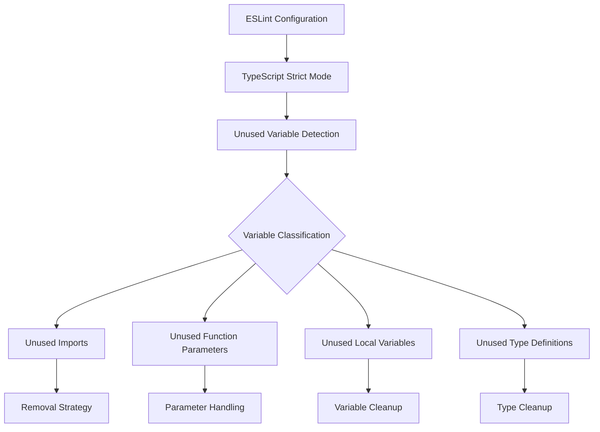
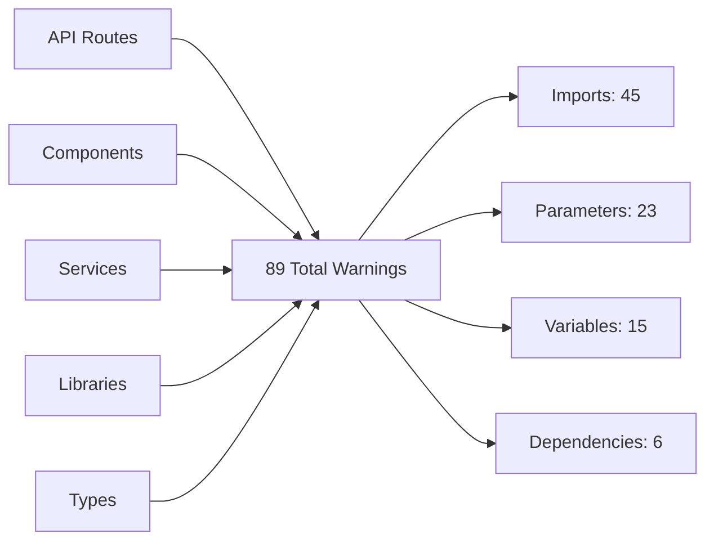
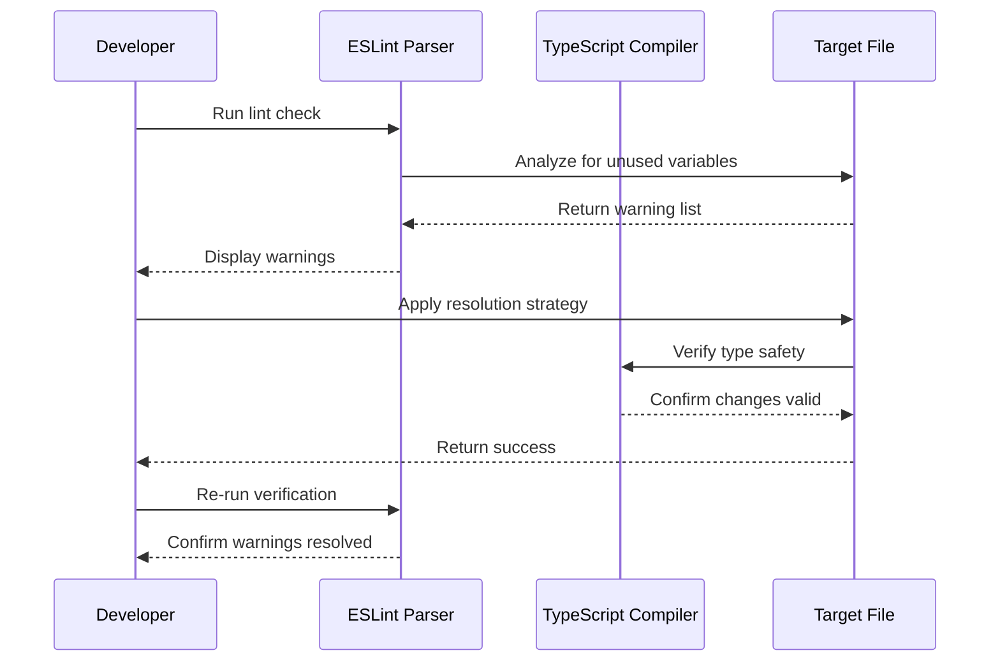
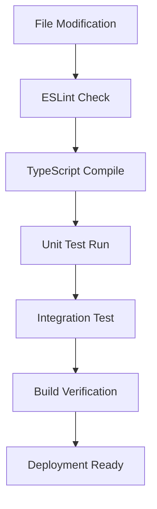

# Remove Unused Variables Design

## Overview

This design document outlines the systematic approach to resolve all TypeScript/ESLint unused variable warnings across the remis-fantasy codebase. The project currently has 89 unused variable warnings that need to be addressed to improve code quality, maintainability, and comply with the project's strict ESLint configuration.

## Technology Stack & Dependencies

- **TypeScript**: Type-safe JavaScript with strict mode enabled
- **ESLint**: Code quality enforcement with Next.js configuration
- **Next.js 15**: React framework with App Router
- **React 19**: Frontend library with strict mode
- **Node.js**: Runtime environment

## Architecture

### Code Quality Framework



### Issue Categories

#### 1. Unused Import Statements

- **Location**: Component and service files
- **Impact**: Bundle size increase, development confusion
- **Resolution**: Direct removal of unused imports

#### 2. Unused Function Parameters

- **Location**: Event handlers, API routes, service methods
- **Impact**: Code readability, function signature clarity
- **Resolution**: Parameter removal or underscore prefixing

#### 3. Unused Local Variables

- **Location**: Component state, function locals, destructured objects
- **Impact**: Memory usage, code clarity
- **Resolution**: Variable removal or usage implementation

#### 4. Unused Type Definitions

- **Location**: Type files and component props
- **Impact**: Type system bloat, import confusion
- **Resolution**: Type removal or usage implementation

## Component Architecture

### File Classification by Warning Types



### Critical Files Analysis

#### High Priority Files (>5 warnings)

1. **FantasyPlanner.tsx** (25 warnings)

   - Unused icons and components
   - Unused state variables
   - Unused utility functions

2. **EnhancedPlayerCard.tsx** (10 warnings)

   - Unused icon imports
   - Unused utility imports

3. **BillingPlansSection.tsx** (8 warnings)
   - Unused error variables
   - Unused parameters

#### Medium Priority Files (2-5 warnings)

- Various service files in `/services/fpl/`
- API route handlers
- Component widgets

#### Low Priority Files (1 warning)

- Individual unused imports
- Single parameter issues

## Data Models & Validation

### Warning Classification Schema

```typescript
interface UnusedVariableWarning {
  file: string;
  line: number;
  column: number;
  variable: string;
  type: "import" | "parameter" | "variable" | "dependency";
  severity: "high" | "medium" | "low";
  resolution: "remove" | "implement" | "prefix" | "ignore";
}
```

### Resolution Strategy Matrix

| Type              | Count | Primary Action    | Secondary Action        |
| ----------------- | ----- | ----------------- | ----------------------- |
| Unused Imports    | 45    | Remove import     | Verify no dynamic usage |
| Unused Parameters | 23    | Prefix with `_`   | Remove if truly unused  |
| Unused Variables  | 15    | Remove variable   | Implement usage         |
| Hook Dependencies | 6     | Add to deps array | Remove if not needed    |

## Business Logic Layer

### Resolution Process Architecture



### File-Specific Resolution Plans

#### API Routes (`/app/api/`)

- **Pattern**: Unused imports and parameters
- **Strategy**: Remove unused imports, prefix unused parameters with `_`
- **Files**: 7 files with 11 warnings

#### Components (`/components/`)

- **Pattern**: Unused icon imports, unused state variables
- **Strategy**: Remove unused imports, implement or remove variables
- **Files**: 12 files with 67 warnings

#### Services (`/services/fpl/`)

- **Pattern**: Unused function parameters, unused variables
- **Strategy**: Remove or implement usage based on business logic
- **Files**: 8 files with 11 warnings

## Middleware & Error Handling

### Validation Strategy

1. **Pre-Resolution Validation**

   - Verify variable is truly unused (no dynamic references)
   - Check for potential future usage in incomplete features
   - Validate removal won't break existing functionality

2. **Post-Resolution Validation**
   - TypeScript compilation check
   - ESLint re-validation
   - Runtime testing for critical paths

### Error Prevention

```typescript
// Example of safe parameter handling
export async function handler(
  request: NextRequest,
  _context: RequestContext // Prefixed but preserved for future use
) {
  // Implementation without context usage
}
```

## Testing Strategy

### Validation Phases

#### Phase 1: Static Analysis

- Run ESLint on modified files
- TypeScript compilation verification
- Import dependency analysis

#### Phase 2: Runtime Validation

- Component rendering tests
- API endpoint functionality tests
- Service method execution tests

#### Phase 3: Integration Testing

- Full application build test
- Feature functionality verification
- Performance impact assessment

### Test Coverage Requirements



## Implementation Phases

### Phase 1: Quick Wins (Estimated: 2 hours)

**Target**: Remove obvious unused imports and simple variables

- API route unused imports (7 files)
- Simple component unused imports (15 instances)
- Unused error variables in try-catch blocks

### Phase 2: Component Cleanup (Estimated: 4 hours)

**Target**: Major component files with multiple warnings

- FantasyPlanner.tsx comprehensive cleanup
- EnhancedPlayerCard.tsx icon cleanup
- Widget components parameter fixes

### Phase 3: Service Layer (Estimated: 3 hours)

**Target**: Service files and business logic

- FPL service unused parameters
- Confidence scoring service cleanup
- Price prediction service optimization

### Phase 4: Validation & Testing (Estimated: 2 hours)

**Target**: Comprehensive validation and testing

- Full ESLint validation
- TypeScript compilation check
- Feature functionality testing
- Performance regression testing

## Risk Assessment

### High Risk Areas

1. **Dynamic Imports**: Variables that might be used dynamically
2. **Future Features**: Variables reserved for incomplete features
3. **Third-party Integration**: Parameters required by external libraries

### Mitigation Strategies

1. **Incremental Changes**: Process files individually
2. **Version Control**: Commit changes in logical groups
3. **Testing**: Validate each change before proceeding
4. **Rollback Plan**: Maintain ability to revert changes

## Code Quality Standards

### ESLint Rule Compliance

- `@typescript-eslint/no-unused-vars`: Primary target rule
- `react-hooks/exhaustive-deps`: Secondary dependency rule
- `@next/next/no-img-element`: Related optimization rule

### TypeScript Standards

- Maintain strict type checking
- Preserve type safety during variable removal
- Update type definitions as needed

### Code Review Checklist

- [ ] All unused variables identified and addressed
- [ ] No runtime functionality broken
- [ ] TypeScript compilation successful
- [ ] ESLint warnings eliminated
- [ ] Performance impact assessed
- [ ] Documentation updated if needed

## Performance Considerations

### Bundle Size Impact

- Removing unused imports reduces bundle size
- Dead code elimination improves tree-shaking
- Faster compilation times

### Runtime Performance

- Reduced memory allocation
- Fewer variable declarations
- Improved code readability and maintainability

### Development Experience

- Cleaner codebase for future development
- Reduced confusion from unused code
- Better IDE performance with fewer false positives
