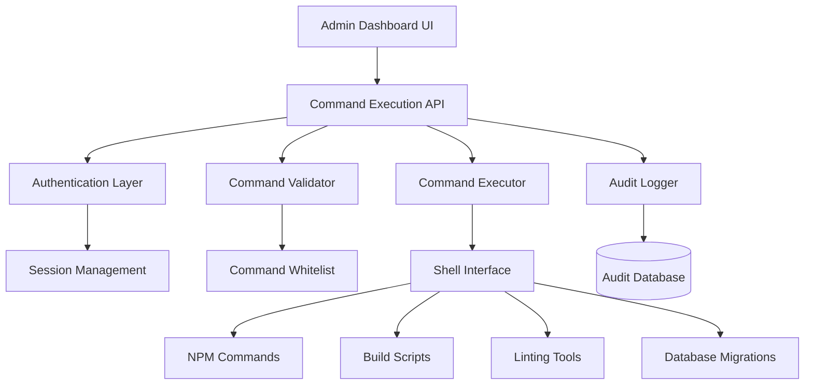
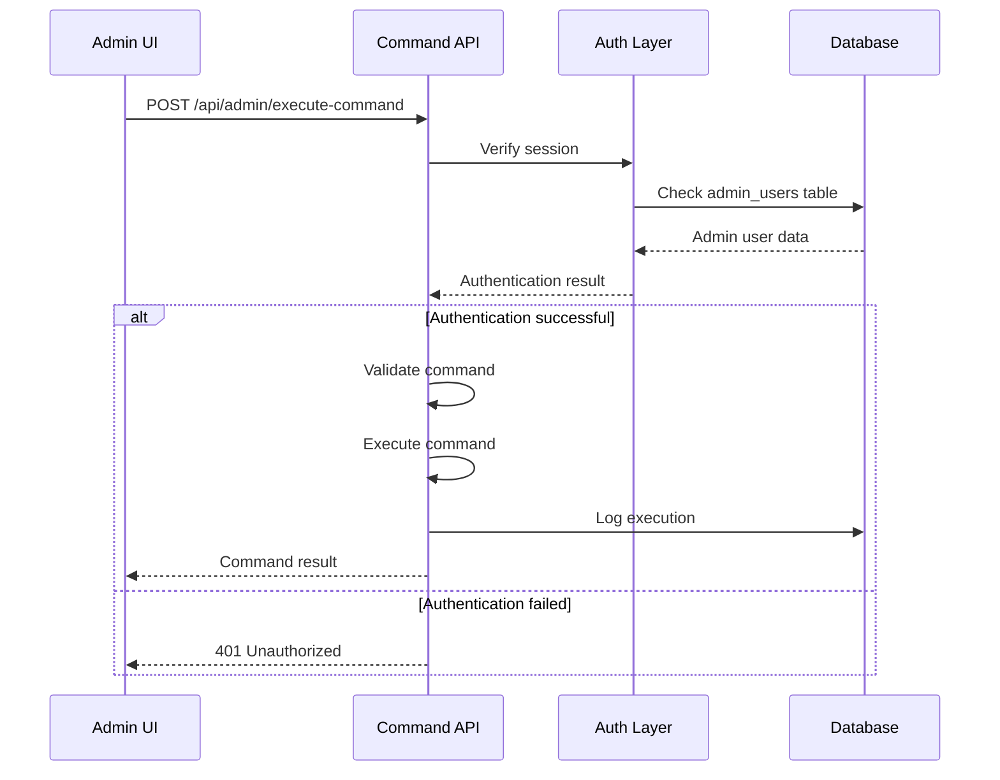

# Sudo Command Execution System Design

## Overview

This design document outlines the implementation of a secure administrative command execution system for the remis-fantasy project. The system will allow authorized administrators to execute privileged operations such as build processes, linting, dependency management, and database migrations through a web interface with proper authentication and audit logging.

## Architecture

### System Architecture



### Component Architecture

The system follows a layered architecture with clear separation of concerns:

1. **Presentation Layer**: React components for command interface
2. **API Layer**: Next.js API routes for command handling
3. **Security Layer**: Authentication and authorization middleware
4. **Business Logic Layer**: Command validation and execution
5. **Data Layer**: Audit logging and session management

## API Endpoints Reference

### Command Execution Endpoint

**POST** `/api/admin/execute-command`

#### Request Schema

```typescript
{
  command: string;           // The command to execute
  args?: string[];          // Optional command arguments
  workingDirectory?: string; // Working directory (defaults to project root)
  timeout?: number;         // Timeout in milliseconds (max 300000)
}
```

#### Response Schema

```typescript
{
  success: boolean;
  output: string;
  error?: string;
  executionTime: number;
  commandId: string;
}
```

#### Authentication Requirements

- Valid admin session via NextAuth
- Admin role verification
- Rate limiting: 10 commands per minute per admin

### Command History Endpoint

**GET** `/api/admin/command-history`

Returns paginated list of executed commands with execution details.

## Data Models & Database Schema

### Command Execution Log Table

```sql
CREATE TABLE command_execution_logs (
  id UUID DEFAULT gen_random_uuid() PRIMARY KEY,
  admin_id UUID NOT NULL REFERENCES admin_users(id),
  command TEXT NOT NULL,
  args JSONB,
  working_directory TEXT,
  status VARCHAR(20) NOT NULL, -- 'success', 'error', 'timeout'
  output TEXT,
  error_message TEXT,
  execution_time_ms INTEGER,
  ip_address INET,
  user_agent TEXT,
  created_at TIMESTAMP WITH TIME ZONE DEFAULT NOW()
);

CREATE INDEX idx_command_logs_admin_id ON command_execution_logs(admin_id);
CREATE INDEX idx_command_logs_created_at ON command_execution_logs(created_at);
```

### Rate Limiting Table

```sql
CREATE TABLE admin_rate_limits (
  admin_id UUID PRIMARY KEY REFERENCES admin_users(id),
  commands_executed INTEGER DEFAULT 0,
  window_start TIMESTAMP WITH TIME ZONE DEFAULT NOW(),
  UNIQUE(admin_id)
);
```

## Business Logic Layer

### Command Validation System

#### Whitelisted Commands

```typescript
const ALLOWED_COMMANDS = {
  npm: {
    subcommands: ["install", "run", "audit", "update"],
    args: {
      run: ["build", "lint", "dev", "start"],
      install: ["--force", "--legacy-peer-deps"],
      audit: ["--audit-level", "fix"],
    },
  },
  next: {
    subcommands: ["build", "lint"],
    args: {
      lint: ["--fix", "--quiet"],
    },
  },
  git: {
    subcommands: ["status", "log", "diff"],
    args: {
      log: ["--oneline", "-n"],
    },
  },
};
```

#### Validation Rules

1. **Command Whitelist**: Only pre-approved commands are allowed
2. **Argument Validation**: Arguments must match allowed patterns
3. **Path Traversal Prevention**: No `../` or absolute paths in arguments
4. **Special Character Filtering**: Remove potentially dangerous characters
5. **Length Limits**: Commands and arguments have maximum length limits

### Security Measures

#### Authentication Flow



#### Rate Limiting Strategy

- **Per-admin limits**: 10 commands per 1-minute window
- **Global limits**: 50 commands per minute across all admins
- **Progressive delays**: Increasing delays for repeated violations
- **Lockout mechanism**: Temporary lockout after 3 violations

## Component Definitions

### CommandExecutionPanel Component

```typescript
interface CommandExecutionPanelProps {
  onCommandExecute: (result: CommandResult) => void;
  disabled?: boolean;
}

interface CommandResult {
  success: boolean;
  output: string;
  error?: string;
  executionTime: number;
}
```

#### Component Features

- **Command Builder**: Dropdown for selecting commands and arguments
- **Real-time Output**: Live streaming of command output
- **History Integration**: Quick access to recently executed commands
- **Validation Feedback**: Real-time validation of command input

### CommandHistoryPanel Component

```typescript
interface CommandHistoryPanelProps {
  adminId: string;
  pageSize?: number;
}

interface CommandHistoryEntry {
  id: string;
  command: string;
  status: "success" | "error" | "timeout";
  executionTime: number;
  createdAt: Date;
  output: string;
}
```

#### Component Features

- **Pagination**: Efficient browsing of command history
- **Filtering**: Filter by status, date range, command type
- **Export**: Export command logs for audit purposes
- **Quick Retry**: Re-execute previous commands

## Testing Strategy

### Unit Testing

#### Command Validator Tests

```typescript
describe("CommandValidator", () => {
  test("should allow whitelisted npm commands", () => {
    expect(validateCommand("npm", ["run", "build"])).toBe(true);
  });

  test("should reject dangerous commands", () => {
    expect(validateCommand("rm", ["-rf", "/"])).toBe(false);
  });

  test("should prevent path traversal", () => {
    expect(validateCommand("npm", ["run", "../../../etc/passwd"])).toBe(false);
  });
});
```

#### Security Tests

```typescript
describe("Security", () => {
  test("should require admin authentication", async () => {
    const response = await request(app)
      .post("/api/admin/execute-command")
      .send({ command: "npm run build" });

    expect(response.status).toBe(401);
  });

  test("should enforce rate limiting", async () => {
    // Execute 11 commands rapidly
    for (let i = 0; i < 11; i++) {
      await executeCommand("npm run lint");
    }

    const response = await executeCommand("npm run build");
    expect(response.status).toBe(429);
  });
});
```

### Integration Testing

#### End-to-End Command Execution

```typescript
describe("Command Execution Flow", () => {
  test("should execute build command successfully", async () => {
    await loginAsAdmin();

    const result = await executeCommand({
      command: "npm",
      args: ["run", "build"],
    });

    expect(result.success).toBe(true);
    expect(result.output).toContain("Build completed");
  });

  test("should log command execution", async () => {
    await executeCommand({ command: "npm", args: ["run", "lint"] });

    const logs = await getCommandHistory();
    expect(logs[0].command).toBe("npm run lint");
  });
});
```

## Implementation Phases

### Phase 1: Core Infrastructure

- [ ] Basic command execution API endpoint
- [ ] Authentication middleware integration
- [ ] Command validation system
- [ ] Database schema creation
- [ ] Basic audit logging

### Phase 2: Security Enhancement

- [ ] Rate limiting implementation
- [ ] Input sanitization
- [ ] Error handling and logging
- [ ] Security headers and CORS
- [ ] IP-based access controls

### Phase 3: User Interface

- [ ] Admin dashboard command panel
- [ ] Real-time output streaming
- [ ] Command history viewer
- [ ] Command builder interface
- [ ] Status indicators and notifications

### Phase 4: Advanced Features

- [ ] Command scheduling
- [ ] Batch command execution
- [ ] Export/import functionality
- [ ] Advanced filtering and search
- [ ] Performance monitoring

## Error Handling

### Error Categories

1. **Authentication Errors**

   - Invalid session
   - Insufficient permissions
   - Rate limit exceeded

2. **Validation Errors**

   - Command not whitelisted
   - Invalid arguments
   - Path traversal attempt

3. **Execution Errors**
   - Command timeout
   - Process failure
   - System resource limitations

### Error Response Format

```typescript
interface ErrorResponse {
  error: string;
  code: string;
  details?: {
    field?: string;
    allowedValues?: string[];
    suggestion?: string;
  };
  timestamp: string;
  requestId: string;
}
```

## Monitoring and Observability

### Metrics Collection

- **Command execution success rate**
- **Average execution time by command type**
- **Rate limiting violations**
- **Authentication failures**
- **System resource usage during executions**

### Alerting

- **Failed authentication attempts > 5 per minute**
- **Command execution failures > 20% in 5 minutes**
- **System resource usage > 80%**
- **Unusual command patterns detected**

### Logging Strategy

```typescript
interface CommandLog {
  level: "info" | "warn" | "error";
  message: string;
  metadata: {
    adminId: string;
    command: string;
    executionTime?: number;
    ip: string;
    userAgent: string;
  };
  timestamp: Date;
}
```

## Security Considerations

### Input Sanitization

- Remove shell metacharacters (`|`, `&`, `;`, `$`, `` ` ``)
- Validate argument patterns with regex
- Prevent injection attacks
- Limit argument length and count

### Process Isolation

- Execute commands in isolated environment
- Limit system resource access
- Use dedicated user account with minimal privileges
- Implement process timeout mechanisms

### Audit Trail

- Log all command executions with full context
- Include IP address and user agent
- Store command output for forensic analysis
- Implement log integrity verification

## Performance Optimization

### Caching Strategy

- Cache command validation results
- Store frequently used command templates
- Implement result caching for read-only commands

### Resource Management

- Implement command queuing for high load
- Limit concurrent executions
- Monitor system resources during execution
- Implement graceful degradation

This design provides a comprehensive foundation for implementing secure administrative command execution in the remis-fantasy project, with proper authentication, validation, and audit capabilities.
