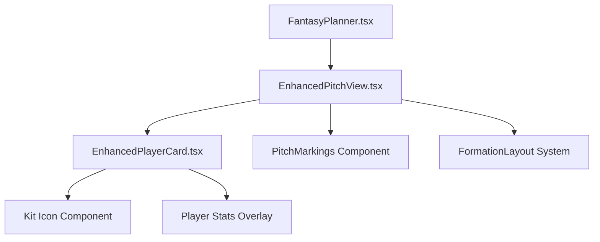

# Enhanced Fantasy Premier League Pitch Layout Design

## Overview

This design document outlines improvements to the Fantasy Premier League pitch layout component to enhance visual presentation and user experience. The primary focus is on correcting player positioning, implementing proper goal orientation, and integrating kit icons for better visual representation.

## Technology Stack & Dependencies

**Framework & Libraries:**

- React 19 with Next.js 15
- TypeScript for type safety
- Framer Motion for animations
- Tailwind CSS for styling
- React Icons (react-icons/fa, react-icons/bi) for kit representations

**Current Component Structure:**

- `FantasyPlanner.tsx` - Main container component
- `EnhancedPitchView.tsx` - Pitch layout component
- `EnhancedPlayerCard.tsx` - Individual player representation

## Current Implementation Issues

### 1. Player Positioning Problems

- Players are tilted upward instead of downward toward the opponent's goal
- Player positioning is shifted to the right instead of being centered
- Goal orientation is reversed (our goal should be at bottom, opponent at top)

### 2. Visual Representation Issues

- Current use of BiFootball icons lacks team identity
- Missing proper kit icon integration from react-icons

## Enhanced Pitch Layout Architecture

### Component Hierarchy



### Formation System Enhancement

#### Corrected Goal Orientation

- **Our Goal**: Bottom of pitch (y: 10% from bottom)
- **Opponent Goal**: Top of pitch (y: 90% from bottom)
- **Attack Direction**: Bottom to top (defensive to attacking flow)

#### Centered Player Positioning

```typescript
interface FormationLayout {
  formation: string;
  positions: {
    goalkeepers: Array<{ x: 50; y: 10 }>; // Centered at bottom
    defenders: Array<{ x: number; y: 25 }>; // Defensive line
    midfielders: Array<{ x: number; y: 55 }>; // Middle third
    forwards: Array<{ x: number; y: 80 }>; // Attacking line
  };
}
```

### Formation Positioning Corrections

#### 3-4-3 Formation (Corrected)

```typescript
{
  goalkeepers: [{ x: 50, y: 10 }],  // Goalkeeper at our goal
  defenders: [
    { x: 25, y: 25 },   // Left center-back
    { x: 50, y: 25 },   // Center center-back
    { x: 75, y: 25 }    // Right center-back
  ],
  midfielders: [
    { x: 20, y: 50 },   // Left midfielder
    { x: 40, y: 55 },   // Left center-mid
    { x: 60, y: 55 },   // Right center-mid
    { x: 80, y: 50 }    // Right midfielder
  ],
  forwards: [
    { x: 30, y: 80 },   // Left forward
    { x: 50, y: 85 },   // Center forward
    { x: 70, y: 80 }    // Right forward
  ]
}
```

#### 4-3-3 Formation (Corrected)

```typescript
{
  goalkeepers: [{ x: 50, y: 10 }],
  defenders: [
    { x: 15, y: 25 },   // Left-back
    { x: 35, y: 25 },   // Left center-back
    { x: 65, y: 25 },   // Right center-back
    { x: 85, y: 25 }    // Right-back
  ],
  midfielders: [
    { x: 30, y: 55 },   // Left midfielder
    { x: 50, y: 55 },   // Center midfielder
    { x: 70, y: 55 }    // Right midfielder
  ],
  forwards: [
    { x: 25, y: 85 },   // Left winger
    { x: 50, y: 85 },   // Striker
    { x: 75, y: 85 }    // Right winger
  ]
}
```

## Kit Icon Integration

### React Icons Kit System

#### Icon Selection Strategy

```typescript
import { FaFutbol, FaShirt } from "react-icons/fa";
import { GiSoccerKick, GiGoalKeeper } from "react-icons/gi";

// Position-based kit icons
const getKitIcon = (position: string) => {
  switch (position) {
    case "GK":
      return GiGoalKeeper;
    case "DEF":
      return FaShirt;
    case "MID":
      return FaShirt;
    case "FWD":
      return GiSoccerKick;
    default:
      return FaShirt;
  }
};
```

### Enhanced Player Card Design

#### Kit Icon Implementation

```typescript
interface KitIconProps {
  teamColors: { primary: string; secondary: string };
  position: "GK" | "DEF" | "MID" | "FWD";
  size: "compact" | "normal" | "large";
}

const KitIcon = ({ teamColors, position, size }: KitIconProps) => {
  const IconComponent = getKitIcon(position);
  const sizeClasses = {
    compact: "w-6 h-6",
    normal: "w-8 h-8",
    large: "w-12 h-12",
  };

  return (
    <div
      className={`${sizeClasses[size]} rounded-full flex items-center justify-center shadow-inner relative`}
      style={{
        backgroundColor: teamColors.primary,
        border: `2px solid ${teamColors.secondary}`,
      }}
    >
      <IconComponent
        className="text-xs opacity-90"
        style={{ color: teamColors.secondary }}
      />
    </div>
  );
};
```

## Pitch Visual Enhancements

### Corrected Pitch Markings

#### Goal Area Positioning

```typescript
// SVG Pitch Markings (Corrected)
<svg className="absolute inset-0 w-full h-full" viewBox="0 0 100 100">
  {/* Our Goal (Bottom) */}
  <rect
    x="42"
    y="2"
    width="16"
    height="8"
    fill="none"
    stroke="rgba(255,255,255,0.8)"
    strokeWidth="0.3"
  />
  <rect
    x="44"
    y="2"
    width="12"
    height="5"
    fill="none"
    stroke="rgba(255,255,255,0.8)"
    strokeWidth="0.3"
  />

  {/* Opponent Goal (Top) */}
  <rect
    x="42"
    y="90"
    width="16"
    height="8"
    fill="none"
    stroke="rgba(255,255,255,0.8)"
    strokeWidth="0.3"
  />
  <rect
    x="44"
    y="93"
    width="12"
    height="5"
    fill="none"
    stroke="rgba(255,255,255,0.8)"
    strokeWidth="0.3"
  />

  {/* Center circle */}
  <circle
    cx="50"
    cy="50"
    r="8"
    fill="none"
    stroke="rgba(255,255,255,0.6)"
    strokeWidth="0.2"
  />
</svg>
```

#### Position Labels (Corrected)

```typescript
<div className="absolute inset-0 pointer-events-none">
  <div
    className="absolute top-4 left-1/2 transform -translate-x-1/2 
                  text-white/80 text-sm font-bold tracking-wide"
  >
    OPPONENT GOAL
  </div>
  <div
    className="absolute bottom-4 left-1/2 transform -translate-x-1/2 
                  text-white/80 text-sm font-bold tracking-wide"
  >
    OUR GOAL
  </div>
</div>
```

## Player Animation & Interaction

### Enhanced Player Positioning Animation

#### Staggered Player Entrance

```typescript
const renderPositionedPlayer = (positionedPlayer, index) => (
  <motion.div
    key={positionedPlayer.player_id}
    initial={{
      opacity: 0,
      y: 30, // Enter from below (toward our goal)
      scale: 0.8,
    }}
    animate={{
      opacity: 1,
      y: 0,
      scale: 1,
    }}
    transition={{
      delay: 0.1 + index * 0.08, // Stagger by position
      type: "spring",
      stiffness: 200,
      damping: 20,
    }}
    style={{
      position: "absolute",
      left: `${positionedPlayer.x}%`,
      bottom: `${positionedPlayer.y}%`, // Position from bottom
      transform: "translate(-50%, 50%)", // Center the player
    }}
  >
    <EnhancedPlayerCard
      player={player}
      teamColors={teamColors}
      position={positionedPlayer.position_type}
      isCaptain={positionedPlayer.is_captain}
      isViceCaptain={positionedPlayer.is_vice_captain}
    />
  </motion.div>
);
```

### Mobile-Responsive Design

#### Responsive Player Sizing

```typescript
interface ResponsivePlayerSizes {
  mobile: {
    card: "w-10 h-12";
    kit: "w-6 h-6";
    text: "text-xs";
  };
  tablet: {
    card: "w-12 h-14";
    kit: "w-8 h-8";
    text: "text-xs";
  };
  desktop: {
    card: "w-14 h-18 lg:w-16 lg:h-20";
    kit: "w-10 h-10 lg:w-12 lg:h-12";
    text: "text-xs lg:text-sm";
  };
}
```

## Interactive Features

### Player Selection & Comparison

#### Enhanced Touch Interactions

```typescript
interface TouchInteraction {
  onPlayerTap: (player) => void;
  onPlayerLongPress: (player) => void;
  onPlayerDrag: (player, position) => void;
  compareMode: boolean;
  selectedPlayers: number[];
}
```

### Formation Switching Animation

#### Smooth Position Transitions

```typescript
const animateFormationChange = (oldFormation, newFormation) => {
  return {
    initial: { x: oldPosition.x, y: oldPosition.y },
    animate: { x: newPosition.x, y: newPosition.y },
    transition: {
      type: "spring",
      stiffness: 100,
      damping: 15,
      duration: 0.8,
    },
  };
};
```

## Testing Strategy

### Visual Regression Testing

- Pitch layout positioning across different formations
- Player centering on various screen sizes
- Goal orientation correctness
- Kit icon rendering with team colors

### Interactive Testing

- Touch interactions on mobile devices
- Formation switching animations
- Player selection in compare mode
- Responsive behavior across breakpoints

### Performance Testing

- Animation performance with 11+ players
- Memory usage during formation transitions
- Rendering optimization for older devices

## Implementation Priority

### Phase 1: Core Positioning Fixes

1. Correct goal orientation (our goal at bottom)
2. Center player positioning horizontally
3. Fix formation coordinate system

### Phase 2: Visual Enhancements

1. Implement kit icons from react-icons
2. Enhanced team color integration
3. Improved pitch markings

### Phase 3: Animation Improvements

1. Staggered player entrance animations
2. Formation transition animations
3. Touch interaction enhancements

### Phase 4: Mobile Optimization

1. Responsive sizing system
2. Touch gesture improvements
3. Performance optimizations
