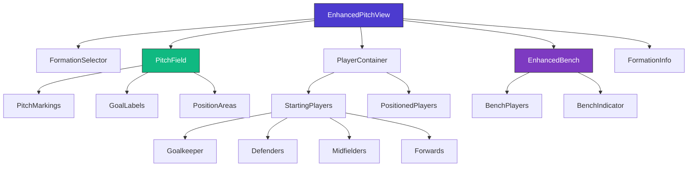
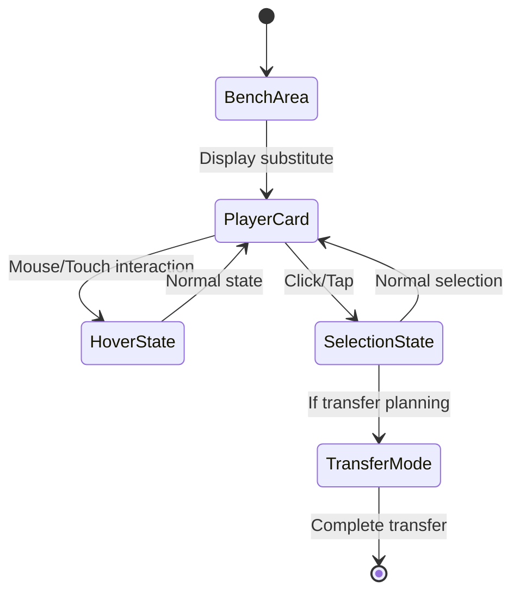

# Transfer Planner Pitch View Enhancement Design

## Overview

This design document outlines enhancements to the Transfer Planner's pitch view component, focusing on improved player positioning, formation orientation, visual design, and mobile responsiveness. The goal is to create a more intuitive and visually appealing football pitch visualization that correctly represents tactical formations and provides an enhanced user experience.

## Technology Stack & Dependencies

### Current Implementation

- **Component**: EnhancedPitchView.tsx
- **Styling**: Tailwind CSS with Framer Motion animations
- **State Management**: React hooks (useState, useMemo, useCallback)
- **TypeScript Types**: FormationLayout, PitchPlayerPosition interfaces

### Enhanced Features

- **Responsive Design**: Mobile-first approach with touch-friendly interactions
- **Visual Improvements**: Enhanced bench design, better player positioning
- **Formation Logic**: Corrected tactical orientation (attacking downward)

## Component Architecture

### Enhanced Pitch View Structure



## Enhanced Player Positioning System

### Formation Orientation Correction

The current system will be enhanced to properly orient formations with:

- **Our Goal**: Bottom of the pitch (y: 5-15)
- **Opponent Goal**: Top of the pitch (y: 85-95)
- **Attack Direction**: Downward (towards opponent goal)
- **Defense Direction**: Upward (protecting our goal)

### Updated Formation Layouts

```typescript
interface EnhancedFormationLayout {
  formation: string;
  positions: {
    goalkeepers: Position[];
    defenders: Position[];
    midfielders: Position[];
    forwards: Position[];
  };
  pitch_dimensions: {
    width: number;
    height: number;
    padding: { top: number; bottom: number; left: number; right: number };
  };
}

interface Position {
  x: number; // 0-100 (left to right)
  y: number; // 0-100 (bottom to top, corrected orientation)
  role?: "LB" | "CB" | "RB" | "LM" | "CM" | "RM" | "LW" | "ST" | "RW";
}
```

### Formation Position Adjustments

#### 4-3-3 Formation (Corrected)

```typescript
"4-3-3": {
  goalkeepers: [{ x: 50, y: 8 }], // Closer to our goal
  defenders: [
    { x: 18, y: 22, role: 'LB' }, // Left-back
    { x: 38, y: 25, role: 'CB' }, // Center-back 1
    { x: 62, y: 25, role: 'CB' }, // Center-back 2
    { x: 82, y: 22, role: 'RB' }  // Right-back
  ],
  midfielders: [
    { x: 25, y: 55, role: 'LM' }, // Left midfielder
    { x: 50, y: 58, role: 'CM' }, // Central midfielder
    { x: 75, y: 55, role: 'RM' }  // Right midfielder
  ],
  forwards: [
    { x: 22, y: 88, role: 'LW' }, // Left winger
    { x: 50, y: 92, role: 'ST' }, // Striker
    { x: 78, y: 88, role: 'RW' }  // Right winger
  ]
}
```

#### 3-5-2 Formation (Corrected)

```typescript
"3-5-2": {
  goalkeepers: [{ x: 50, y: 8 }],
  defenders: [
    { x: 25, y: 22, role: 'CB' }, // Left center-back
    { x: 50, y: 25, role: 'CB' }, // Central center-back
    { x: 75, y: 22, role: 'CB' }  // Right center-back
  ],
  midfielders: [
    { x: 12, y: 45, role: 'LM' }, // Left wing-back
    { x: 30, y: 55, role: 'CM' }, // Left central midfielder
    { x: 50, y: 58, role: 'CM' }, // Central midfielder
    { x: 70, y: 55, role: 'CM' }, // Right central midfielder
    { x: 88, y: 45, role: 'RM' }  // Right wing-back
  ],
  forwards: [
    { x: 40, y: 90, role: 'ST' }, // Left striker
    { x: 60, y: 90, role: 'ST' }  // Right striker
  ]
}
```

## Enhanced Bench Design

### Current Bench Issues

- Basic horizontal layout
- No visual indication of substitution area
- Limited mobile optimization

### Enhanced Bench Features



### Bench Visual Design

#### Styling Enhancements

```css
.enhanced-bench {
  background: linear-gradient(135deg, #f3f4f6 0%, #e5e7eb 100%);
  border: 2px solid #d1d5db;
  border-radius: 1rem;
  padding: 1rem;
  position: relative;

  &::before {
    content: "BENCH";
    position: absolute;
    top: -8px;
    left: 16px;
    background: #374151;
    color: white;
    padding: 2px 8px;
    border-radius: 4px;
    font-size: 0.75rem;
    font-weight: bold;
  }
}

.bench-indicator {
  background: linear-gradient(90deg, #10b981, #059669);
  height: 4px;
  width: 100%;
  margin-bottom: 0.75rem;
  border-radius: 2px;
}
```

#### Mobile-Optimized Layout

```typescript
interface BenchLayoutProps {
  isMobile: boolean;
  isTablet: boolean;
  benchPlayers: EnhancedPlayerData[];
}

const BenchLayout = {
  mobile: {
    gridCols: 2,
    playerSize: "compact",
    spacing: "tight",
  },
  tablet: {
    gridCols: 4,
    playerSize: "medium",
    spacing: "normal",
  },
  desktop: {
    gridCols: 4,
    playerSize: "full",
    spacing: "comfortable",
  },
};
```

## Mobile-First Responsive Design

### Viewport Adaptations

#### Breakpoint Strategy

```typescript
const ResponsiveConfig = {
  mobile: {
    maxWidth: "640px",
    pitchHeight: "400px",
    playerSize: "32px",
    fontSize: "10px",
    touchTargetSize: "44px",
  },
  tablet: {
    maxWidth: "768px",
    pitchHeight: "500px",
    playerSize: "40px",
    fontSize: "12px",
    touchTargetSize: "48px",
  },
  desktop: {
    maxWidth: "1024px+",
    pitchHeight: "600px",
    playerSize: "48px",
    fontSize: "14px",
    touchTargetSize: "52px",
  },
};
```

#### Touch-Friendly Interactions

```typescript
interface TouchInteraction {
  minTouchTarget: 44; // iOS/Android minimum
  tapGesture: "single" | "double";
  longPress: boolean;
  swipeGesture: boolean;
  dragAndDrop: boolean;
}

const TouchBehavior = {
  playerCard: {
    tap: "select",
    longPress: "contextMenu",
    drag: "reposition",
  },
  formation: {
    swipeLeft: "previousFormation",
    swipeRight: "nextFormation",
  },
};
```

## Player Card Enhancements

### Visual Improvements

#### Player Kit Representation

```typescript
interface PlayerKitDesign {
  teamColors: {
    primary: string;
    secondary: string;
    accent: string;
  };
  positionBadge: {
    color: PositionColor;
    icon: PositionIcon;
  };
  statusIndicators: {
    captain: "C";
    viceCaptain: "V";
    injured: "🚑";
    suspended: "⚠️";
  };
}
```

#### Hover/Touch Feedback

```typescript
interface PlayerInteraction {
  hover: {
    scale: 1.1;
    elevation: "shadow-lg";
    animation: "spring";
    statsPreview: boolean;
  };
  selected: {
    border: "2px solid blue";
    glow: "shadow-blue-400/50";
    zIndex: 20;
  };
  active: {
    pulse: boolean;
    highlight: string;
  };
}
```

## Formation Validation & Logic

### Position Constraint System

```typescript
interface FormationConstraints {
  maxPlayersPerPosition: {
    goalkeeper: 1;
    defender: 5;
    midfielder: 5;
    forward: 3;
  };
  positionValidation: (formation: string) => boolean;
  autoCorrection: boolean;
}

const validateFormation = (
  formation: string,
  players: Player[]
): ValidationResult => {
  // Validate player count per position
  // Check formation syntax (e.g., "4-3-3")
  // Ensure tactical validity
  // Return validation errors or success
};
```

### Dynamic Formation Switching

```typescript
interface FormationTransition {
  from: string;
  to: string;
  playerMovements: PlayerMovement[];
  animationDuration: number;
  transitionType: "smooth" | "stepped";
}

interface PlayerMovement {
  playerId: number;
  fromPosition: Position;
  toPosition: Position;
  delay: number;
}
```

## Performance Optimizations

### Rendering Efficiency

#### Virtual Positioning

```typescript
const useVirtualPitch = (players: Player[], viewport: Viewport) => {
  return useMemo(() => {
    // Only render players within viewport
    // Use transform3d for GPU acceleration
    // Optimize re-renders with position changes
    return visiblePlayers.map(optimizePlayerPosition);
  }, [players, viewport]);
};
```

#### Animation Performance

```typescript
const AnimationConfig = {
  useGPUAcceleration: true,
  reducedMotion: "respect-user-preference",
  frameThrottling: 60, // fps
  lazyLoading: true,
  intersection: {
    threshold: 0.1,
    rootMargin: "50px",
  },
};
```

### Memory Management

#### Player Data Caching

```typescript
const usePlayerCache = () => {
  const cache = useRef(new Map<number, EnhancedPlayerData>());

  const getCachedPlayer = useCallback((id: number) => {
    if (!cache.current.has(id)) {
      cache.current.set(id, enhancePlayerData(id));
    }
    return cache.current.get(id);
  }, []);

  return { getCachedPlayer, clearCache: () => cache.current.clear() };
};
```

## Testing Strategy

### Visual Regression Testing

```typescript
describe("EnhancedPitchView Visual Tests", () => {
  test("formation layouts render correctly", () => {
    // Test each formation layout
    // Verify player positioning accuracy
    // Check responsive breakpoints
  });

  test("bench design improvements", () => {
    // Verify bench styling
    // Test mobile bench layout
    // Check bench player interactions
  });

  test("mobile responsiveness", () => {
    // Test touch interactions
    // Verify viewport scaling
    // Check accessibility compliance
  });
});
```

### Performance Testing

```typescript
describe("Pitch Performance Tests", () => {
  test("rendering performance with 15 players", () => {
    // Measure initial render time
    // Test animation frame rates
    // Check memory usage
  });

  test("formation switching performance", () => {
    // Test transition smoothness
    // Measure state update performance
    // Verify no memory leaks
  });
});
```

## Implementation Roadmap

### Phase 1: Core Position Fixes

1. **Formation Orientation Correction**

   - Update all formation layouts to attack downward
   - Adjust Y-coordinate calculations
   - Fix goal positioning logic

2. **Player Positioning Refinement**
   - Shift players slightly left for better spacing
   - Implement pixel-perfect positioning
   - Add position validation

### Phase 2: Bench Enhancement

1. **Visual Design Overhaul**

   - Implement bench indicator design
   - Add bench labeling and styling
   - Create substitution area visualization

2. **Mobile Optimization**
   - Implement responsive bench layout
   - Add touch-friendly interactions
   - Optimize for various screen sizes

### Phase 3: Polish & Performance

1. **Animation Improvements**

   - Smooth formation transitions
   - Enhanced player movement animations
   - Performance optimizations

2. **User Experience Enhancements**
   - Improved hover states
   - Better visual feedback
   - Accessibility improvements
