# FPL Fantasy Planner Enhancement Design

## Overview

This design enhances the FantasyPlanner component to provide a comprehensive FPL (Fantasy Premier League) experience including live data, transfer planning, price tracking, ownership changes, chip strategies, and future transfer analytics. The enhancement transforms the current basic team viewer into a full-featured FPL management tool.

## Technology Stack & Dependencies

### Current Stack
- **Frontend**: React 19, Next.js 15, TypeScript
- **Styling**: Tailwind CSS, Framer Motion for animations
- **State Management**: React hooks (useState, useEffect, useMemo, useCallback)
- **Icons**: React Icons (FaShare, FaExpand, etc.), Lucide React
- **API Integration**: FPL Service Layer

### Additional Dependencies Required
- **Chart Visualization**: Chart.js or Recharts for price/ownership charts
- **Date Handling**: date-fns for gameweek calculations
- **Data Tables**: TanStack Table for advanced filtering/sorting
- **Virtual Scrolling**: react-window for large player lists

## Enhanced Component Architecture

### Core Components

#### 1. Enhanced FantasyPlanner (Main Container)
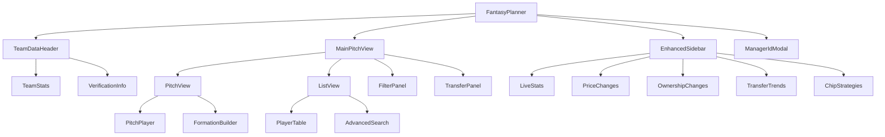

#### 2. Enhanced Sidebar Components

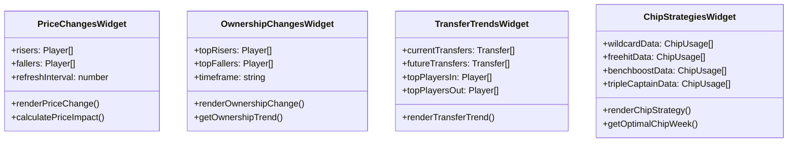

#### 3. Enhanced Pitch View

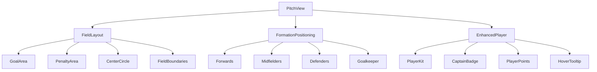

### Data Models & Interfaces

#### Enhanced Player Data
```typescript
interface EnhancedPlayerData extends PlayerData {
  // Price tracking
  price_change_event: number;
  price_change_start: number;
  price_change_event_fall: number;
  
  // Ownership tracking
  ownership_change_1h: number;
  ownership_change_24h: number;
  ownership_trend: 'rising' | 'falling' | 'stable';
  
  // Transfer data
  transfers_in_1h: number;
  transfers_out_1h: number;
  net_transfers: number;
  
  // Performance metrics
  form_rank: number;
  value_rank: number;
  ownership_rank: number;
  
  // Injury/availability
  availability_status: 'available' | 'doubtful' | 'injured' | 'suspended';
  injury_news: string;
  return_date?: string;
}
```

#### Transfer Planning
```typescript
interface TransferPlan {
  playersOut: EnhancedPlayerData[];
  playersIn: EnhancedPlayerData[];
  cost: number;
  freeTransfers: number;
  weekPlanned: number;
  totalCost: number;
  expectedGain: number;
  riskLevel: 'low' | 'medium' | 'high';
}

interface ChipStrategy {
  chipType: 'wildcard' | 'freehit' | 'benchboost' | 'triplecaptain';
  optimalWeeks: number[];
  usage_stats: {
    week: number;
    usage_count: number;
    success_rate: number;
  }[];
}
```

#### Filter & Search State
```typescript
interface EnhancedFilterState extends FilterState {
  // Price filters
  priceChangeMin: number;
  priceChangeMax: number;
  
  // Ownership filters
  ownershipMin: number;
  ownershipMax: number;
  ownershipTrend: string[];
  
  // Transfer filters
  transfersInMin: number;
  transfersOutMin: number;
  
  // Performance filters
  formMin: number;
  valueMin: number;
  
  // Fixture difficulty
  nextFixtureDifficulty: number[];
  fixtureCount: number;
  
  // Advanced search
  searchMode: 'basic' | 'advanced';
  multiplePositions: boolean;
  includeInjured: boolean;
}
```

## Enhanced UI Layout Design

### Main Layout Structure
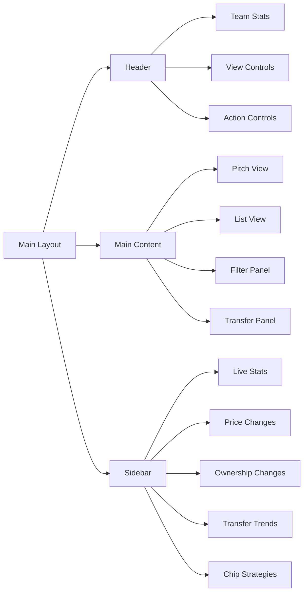

### Responsive Pitch Layout
The pitch view displays a vertical half-field layout optimized for mobile:

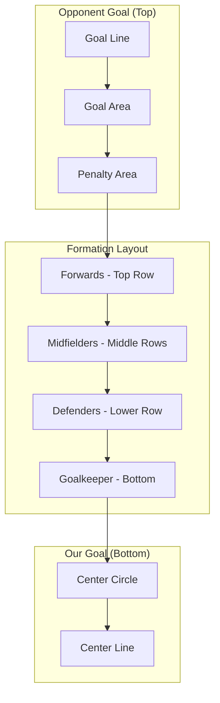

### Enhanced Player Cards
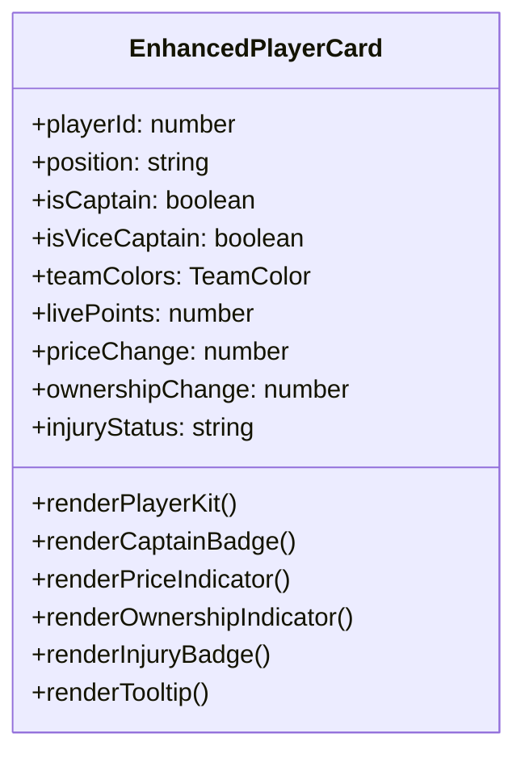

## Sidebar Widget Implementations

### 1. Price Changes Widget
- **Real-time price risers/fallers**
- **Price change indicators with arrows**
- **Impact calculation on user's team**
- **Future price prediction**

### 2. Ownership Changes Widget
- **Hourly ownership changes**
- **Trending players (rising/falling)**
- **Ownership percentage display**
- **Historical ownership graphs**

### 3. Transfer Trends Widget
- **Current week top transfers**
- **Future week transfer plans**
- **Most transferred in/out players**
- **Transfer volume indicators**

### 4. Chip Strategy Widget
- **Optimal chip usage weeks**
- **Historical chip usage statistics**
- **Success rate analysis**
- **Personalized chip recommendations**

## API Integration Architecture

### Enhanced FPL Service Methods

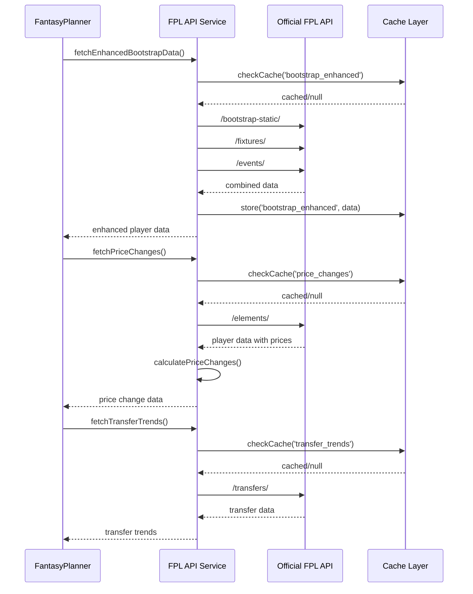

### Required API Endpoints

#### Existing Endpoints to Enhance
- `/api/fpl/bootstrap-static` - Enhanced with price/ownership tracking
- `/api/fpl/load-team` - Enhanced with advanced team analytics
- `/api/fpl/fixtures` - Enhanced with difficulty ratings

#### New Endpoints Required
- `/api/fpl/price-changes` - Real-time price change tracking
- `/api/fpl/ownership-trends` - Ownership change analytics
- `/api/fpl/transfer-analytics` - Transfer trend analysis
- `/api/fpl/chip-strategies` - Chip usage optimization
- `/api/fpl/future-transfers` - Planned transfer analytics

## Enhanced Filter & Search System

### Advanced Player Filtering
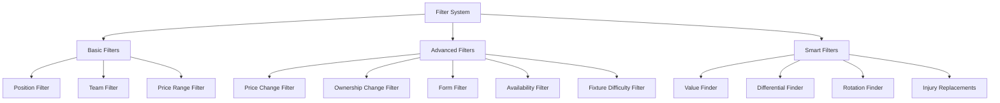

### Search Functionality
- **Multi-criteria search (name, team, position)**
- **Fuzzy search with suggestions**
- **Search history and saved filters**
- **Quick filter presets (differentials, value picks, etc.)**

## Transfer Planning Features

### Transfer Planner Interface
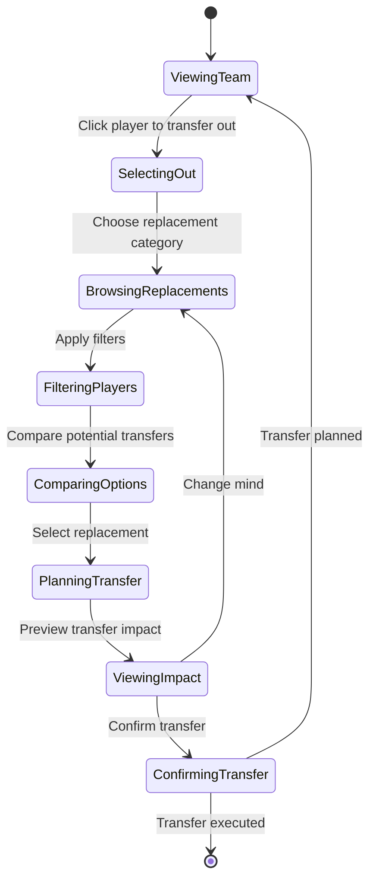

### Transfer Analysis Features
- **Cost calculation (free transfers vs. hits)**
- **Expected points gain/loss analysis**
- **Fixture difficulty comparison**
- **Risk assessment (injury prone, rotation risk)**
- **Alternative suggestions**

## Mobile-First Responsive Design

### Breakpoint Strategy
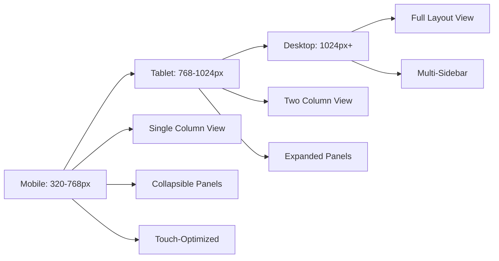

### Mobile Optimizations
- **Collapsible sidebar widgets**
- **Swipe gestures for navigation**
- **Touch-optimized player selection**
- **Reduced data density for small screens**
- **Optimized pitch layout for vertical screens**

## Performance Optimization

### Caching Strategy
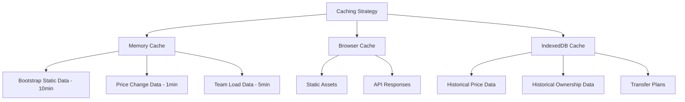

### Virtual Scrolling Implementation
- **Large player lists (500+ players)**
- **Smooth scrolling performance**
- **Dynamic loading based on viewport**
- **Optimized re-rendering**

## Data Synchronization

### Real-time Updates
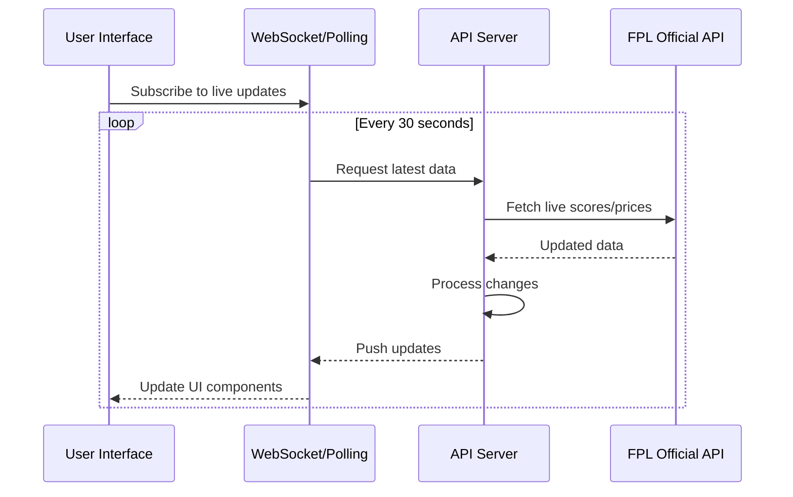

### Update Frequencies
- **Live scores**: 30 seconds during matches
- **Price changes**: 1 minute
- **Ownership changes**: 5 minutes
- **Transfer trends**: 15 minutes
- **Team data**: Manual refresh or 5 minutes

## Testing Strategy

### Component Testing
- **Player card rendering with various states**
- **Filter functionality with complex criteria**
- **Transfer planning workflow**
- **Responsive layout behavior**

### Integration Testing
- **API service integration**
- **Cache invalidation scenarios**
- **Real-time update handling**
- **Error state management**

### Performance Testing
- **Large dataset rendering (1000+ players)**
- **Memory usage optimization**
- **API response time monitoring**
- **Mobile device performance**